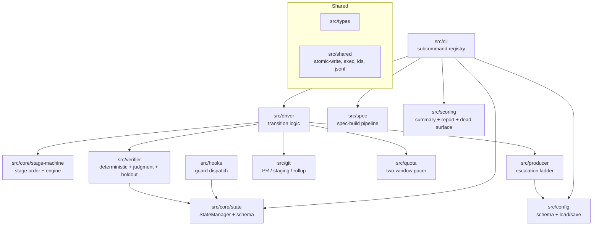

# Components

The deterministic engine is organized into modules under `src/`, each owning one
concern. This document describes the major building blocks and how they relate.
For the system-level picture see [overview.md](./overview.md).

## CLI (`src/cli`)

The public surface. `src/cli/main.ts` holds the frozen subcommand **registry** and
the `dispatch()` function; `src/bin/factory.ts` is the only place `process.exit`
is called. Each subcommand lives in `src/cli/subcommands/` and is a thin wrapper:
parse args, wire production dependencies, call a testable core function, emit one
JSON envelope, return an `ExitCode`. The `next` and `drive` subcommands are thin
shells over the pump (`src/driver`); the fold logic of the retired `record-*`
writers now lives there too. Shared helpers: `args.ts` (flag parsing), `io.ts`
(envelope emission), `wiring.ts` (`loadCliDeps` / `loadPumpDeps`). The complete
surface is in [reference/cli.md](../reference/cli.md).

## State (`src/core/state`)

The frozen state seam. `schema.ts` defines the Zod `RunState` / `TaskState`
schemas with **closed enums** (an out-of-set value is a loud parse error) and
cross-field invariants (e.g. `failure_class` is set _iff_ a task is dropped; a
quota checkpoint exists _iff_ the run is paused/suspended). `manager.ts` is the
`StateManager` — the _only_ sanctioned read/write path (atomic + lock-protected).
`paths.ts` defines the two-store filesystem layout. `derive.ts` computes gate /
panel / floor verdicts from evidence (never stored). See
[reference/state-model.md](../reference/state-model.md).

## Stage machine (`src/core/stage-machine`)

The closed stage vocabulary (`preflight → tests → exec → verify → ship`, plus the
separate run-level `finalize`) and the pure engine that maps a stage to a
`StageResult`. `nextStage()` walks the canonical order; `stageToInFlightStatus()`
keeps the persisted task status in lockstep. The engine never writes state — it
reports; the driver acts.

## Driver (`src/driver`)

The Model-A engine half of the **pump** seam — the loop, plus the transition logic
that turns a `StageResult` into state effects. This is the unit-test target for
control flow and is shared verbatim by both drivers (the session loop and the
Workflow script).

- `next.ts` (`pumpRun`) — the **run-level** pump: terminal/quota checks,
  cascade-drop, and the ready set, emitted as a `NextEnvelope`.
- `pump.ts` (`pumpTask`) — the **task-level** pump: resume at the persisted stage
  cursor, optionally fold the previous spawn's results, then run the stage machine
  until a spawn is needed (emit a `DriveEnvelope` manifest) or the task is
  terminal.
- `fold.ts` — the fold cores `pumpTask --results` calls: `applyRecordProducer`,
  `applyRecordHoldout`, `applyRecordReviews` (folded in from the retired
  `record-*` CLI writers, so the spawn-path fold and a crash-resume fold run
  identical code).
- `transitions.ts` — the shared step primitives (`markInFlight`, `completeTask`,
  `dropStep`, `escalateOrDrop`, `applyProducerOutcome`) the pump and the fold cores
  both call, so a live step and a crash-resume fold can never diverge.
- `ship.ts` opens the PR + serial-merges; `finalize.ts` is the run-completion
  coordinator (report → per-drop issues → rollup → flip terminal, in resume-safe
  order).

## Producer (`src/producer`)

The bounded nuke-and-retry escalation ladder (`ladder.ts`), the model dial
(`model-dial.ts` — each rung changes a variable), failure classification
(`classify.ts` — classify-before-retry), the inner fix-forward patch loop
(`fix-forward.ts`), and the producer prompt-context builder. See
[explanation/producer-ladder.md](../explanation/producer-ladder.md).

## Verifier (`src/verifier`)

Three sub-layers:

- **deterministic** (`deterministic/`) — the `GateRunner` and per-gate
  strategies (test, tdd, coverage, mutation, sast, type, lint, build). Runs each
  enabled strategy, collects evidence, derives the conjunctive verdict. Includes
  the TDD gate (`strategies/tdd.ts`) and the gate evidence memo.
- **judgment** (`judgment/`) — the risk-invariant six-reviewer panel (`panel.ts`,
  `panel-run.ts`), citation-verify (`citation-verify.ts`), and the independent
  finding-verifier (`finding-verifier.ts`) for verify-then-fix.
- **holdout** (`holdout/`) — the answer-key split, store, validator prompt, and
  pass-rate check.

See [explanation/verifier.md](../explanation/verifier.md) and
[reference/quality-gates.md](../reference/quality-gates.md).

## Quota (`src/quota`)

The two-window (5h + 7d) pacer that paces a run against the rising utilization
curves: the `router` (producer-model selection by risk tier), the `pacer` /
`window` / `circuit-breaker` evaluation, the resume planner, and checkpoint
build/clear. See [explanation/quota-pacing.md](../explanation/quota-pacing.md).

## Git (`src/git`)

All GitHub / git I/O: the `git-client` and `gh-client` wrappers, branch + PR
helpers, branch-protection probe/provision, the staging-branch reconciler, the
serial merge writer, and the `staging → develop` rollup.

## Spec (`src/spec`)

The spec-build pipeline: the deterministic spec gates, the 56/60 +
dimension-floor review adjudication, the durable `SpecStore` (keyed by repo +
spec-id), and the spawn-spec builders the `factory spec` reporter actions emit.

## Scoring (`src/scoring`)

The run-outcome reporters: the compact `RunSummary`, the deterministic
partial-run `report.md`, the telemetry sink, and the best-effort `--dead-surface`
scan (unreferenced exports in the run diff via `ts-prune`).

## Config (`src/config`)

The single canonical config: `schema.ts` (one Zod schema with _all_ defaults),
`load.ts` / `save.ts` (resolve + sparse-overlay persist), and the key-path
helpers `configure` uses. See [reference/configuration.md](../reference/configuration.md).

## Hooks (`src/hooks`)

The `factory-hook` guard dispatch (`main.ts`) and the individual guards. These run
at Claude Code tool-use time, independent of any CLI call, to enforce invariants
that must hold _before_ an action (e.g. deny a write to a TCB path, deny a read of
the holdout key, gate `gh pr create`/`merge` on a derived floor verdict). See
[reference/hooks.md](../reference/hooks.md).

## Shared (`src/shared`, `src/types`)

`src/types` re-exports the closed enums, the stage/state types, and the
`StageResult` union — the vocabulary every module shares. `src/shared` holds the
cross-cutting primitives: atomic file write, the exec wrapper, id
generation/validation, JSON/JSONL helpers, logging, secret patterns, and time.
</content>
