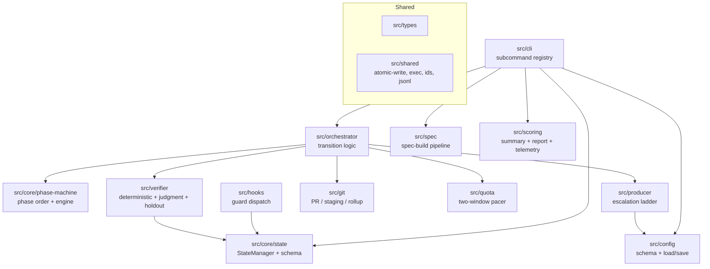

# Components

The deterministic engine is organized into modules under `src/`, each owning one
concern. This document describes the major building blocks and how they relate.
For the system-level picture see [overview.md](./overview.md).

## CLI (`src/cli`)

The public surface. `src/cli/main.ts` holds the frozen subcommand **registry** and
the `dispatch()` function; `src/bin/factory.ts` is the only place `process.exit`
is called. Each subcommand lives in `src/cli/subcommands/` and is a thin wrapper:
parse args, wire production dependencies, call a testable core function, emit one
JSON envelope, return an `ExitCode`. The `next-task` and `next-action` subcommands are thin
shells over the orchestrator (`src/orchestrator`); the record logic of the retired `record-*`
writers now lives there too. Shared helpers: `args.ts` (flag parsing), `io.ts`
(envelope emission), `wiring.ts` (`loadCliDeps` / `loadOrchestratorDeps`). The complete
surface is in [reference/cli.md](../reference/cli.md).

## State (`src/core/state`)

The frozen state seam. `schema.ts` defines the Zod `RunState` / `TaskState`
schemas with **closed enums** (an out-of-set value is a loud parse error) and
cross-field invariants (e.g. `failure_class` is set _iff_ a task is failed; a
quota checkpoint exists _iff_ the run is paused/suspended). `manager.ts` is the
`StateManager` — the _only_ sanctioned read/write path (atomic + lock-protected).
`paths.ts` defines the two-store filesystem layout. `derive.ts` computes gate /
panel / merge-gate verdicts from evidence (never stored). See
[reference/state-model.md](../reference/state-model.md).

## Phase machine (`src/core/phase-machine`)

The closed phase vocabulary (`preflight → tests → exec → verify → ship`, plus the
separate run-level `finalize`) and the pure engine that maps a phase to a
`PhaseResult`. `nextPhase()` walks the canonical order; `phaseToInFlightStatus()`
keeps the persisted task status in lockstep. The engine never writes state — it
reports; the runner acts.

## Orchestrator (`src/orchestrator`)

The deterministic **orchestrator** — the transition logic that turns a
`PhaseResult` into state effects. This is the unit-test target for control flow
and is stepped verbatim by both runners (the session loop and the Workflow
script).

- `next.ts` (`nextTask`) — the **run-level** orchestrator: terminal/quota checks,
  cascade-fail, and the ready set, emitted as a `NextTask`.
- `orchestrator.ts` (`nextAction`) — the **task-level** orchestrator: resume at the persisted phase
  cursor, optionally record the previous spawn's results, then run the phase machine
  until a spawn is needed (emit a `NextAction` spawn request) or the task is
  terminal. It also owns the **spawn-in-flight checkpoint** (`TaskState.spawn_in_flight`):
  on a fresh spawn it captures the task-branch tip; on a resume that re-enters the
  same `(phase, rung)` before any results were recorded, it resets the shared worktree
  to that tip — discarding only the abandoned producer's partial work — before
  re-spawning, so a stop-mid-spawn plus `factory resume` is idempotent.
- `handlers.ts` — the phase **reporters** (`preflight`/`tests`/`exec`/`verify`),
  built by `makePhaseHandlers`. Each reads the frozen `PhaseContext` and returns a
  `PhaseResult`; none writes state or spawns. The `producerSpawn` helper dials the
  model **and effort** for the current rung (`dialForRung`) and threads an optional
  `effort` into the spawn agent. The `ship` and `finalize` entries complete the
  `PhaseHandlers` interface: `finalize` calls the pure `decideFinalize`, while
  `ship` is a deliberate **throw-stub** — `ship` is routed through `shipTask`, never
  dispatched via `runPhase`, so the stub fails loud if that invariant is ever broken.
- `record.ts` — the record cores `nextAction --results` calls: `applyRecordProducer`,
  `applyRecordHoldout`, `applyRecordReviews` (merged in from the retired
  `record-*` CLI writers, so the spawn-path record and a crash-resume record run
  identical code).
- `transitions.ts` — the shared step primitives (`markInFlight`, `completeTask`,
  `failStep`, `escalateOrFail`, `applyProducerOutcome`) the orchestrator and the record cores
  both call, so a live step and a crash-resume record can never diverge.
- `ship.ts` (`shipTask`) opens the PR + serial-merges; `finalize.ts` is the
  run-completion coordinator (report → PRD-issue fails comment → rollup → flip
  terminal, in resume-safe order).

## Producer (`src/producer`)

The escalation cap (`escalation.ts` — `ESCALATION_CAP`), the combined model→effort
dial (`model-dial.ts` — each rung changes a variable), failure classification
(`classify.ts` — classify-before-retry), and the producer prompt-context builder
(`prompt-context.ts`). The ladder's control flow is the runner's, not a producer
module: the rung bump-or-fail is `escalateOrFail` (`src/orchestrator/transitions.ts`) and
the inner fix-forward patch loop is the implementer re-spawn the orchestrator drives
(`src/orchestrator/handlers.ts`). See
[explanation/producer-ladder.md](../explanation/producer-ladder.md).

## Verifier (`src/verifier`)

Three sub-layers:

- **deterministic** (`deterministic/`) — the `GateRunner` and per-gate
  strategies (test, tdd, coverage, mutation, sast, type, lint, build). Runs each
  enabled strategy, collects evidence, derives the conjunctive verdict. Includes
  the TDD gate (`strategies/tdd.ts`) and the gate evidence memo.
- **judgment** (`judgment/`) — the risk-invariant six-reviewer panel (`panel.ts`,
  `panel-run.ts`), citation-verify (`citation-verify.ts`), and the independent
  finding-verifier (`finding-verifier.ts`) for verify-then-fix.
- **holdout** (`holdout/`) — the answer-key split, store, validator prompt, and
  pass-rate check.

See [explanation/verifier.md](../explanation/verifier.md) and
[reference/automated-gates.md](../reference/automated-gates.md).

## Quota (`src/quota`)

The two-window (5h + 7d) pacer that paces a run against the rising utilization
curves: the `router` (producer-model selection by risk tier), the `pacer` /
`window` / `circuit-breaker` evaluation, the resume planner, and checkpoint
build/clear. See [explanation/quota-pacing.md](../explanation/quota-pacing.md).

## Git (`src/git`)

All GitHub / git I/O: the `git-client` and `gh-client` wrappers (incl.
`issueComment`/`issueClose` for closing a delivered PRD), branch + PR helpers,
branch-protection probe/provision, the per-run staging deriver
(`run-staging.ts → staging-<run-id>`), the serial merge writer, and the
`staging-<run-id> → develop` rollup.

## Spec (`src/spec`)

The spec-build pipeline: the deterministic spec gates, the 56/60 +
dimension-floor review adjudication, the durable `SpecStore` (keyed by repo +
spec-id), and the spawn-spec builders the `factory spec` reporter actions emit.

## Scoring (`src/scoring`)

The run-outcome reporters: the compact `RunSummary`, the deterministic
partial-run `report.md`, and the telemetry sink.

## Config (`src/config`)

The single canonical config: `schema.ts` (one Zod schema with _all_ defaults),
`load.ts` / `save.ts` (resolve + sparse-overlay persist), and the key-path
helpers `configure` uses. See [reference/configuration.md](../reference/configuration.md).

## Hooks (`src/hooks`)

The `factory-hook` guard dispatch (`main.ts`) and the individual guards. These run
at Claude Code tool-use time, independent of any CLI call, to enforce invariants
that must hold _before_ an action (e.g. deny a write to a TCB path, deny a read of
the holdout key, deny an agent-initiated `gh pr create`/`merge`). See
[reference/hooks.md](../reference/hooks.md).

## Shared (`src/shared`, `src/types`)

`src/types` re-exports the closed enums, the phase/state types, and the
`PhaseResult` union — the vocabulary every module shares. `src/shared` holds the
cross-cutting primitives: the dependency-free `exit-codes.ts` leaf (the frozen
CLI/hook exit enum, imported by ~every entry point — see
[reference/exit-codes.md](../reference/exit-codes.md)), atomic file write, the exec
wrapper, id generation/validation, JSON/JSONL helpers, logging, secret patterns,
and time.

Several modules are deliberately **leaf modules** — they declare an interface or
constant with no further imports — so heavier modules can share a type without
importing each other transitively. `src/shared/exit-codes.ts`, the registry
interfaces (`src/cli/registry-types.ts`, `src/hooks/registry-types.ts`), and the
`Tcb*` type home (`src/types/tcb.ts`, re-exported by `src/hooks/tcb.ts` for
back-compat) exist to break import cycles. The no-circular-dependency bar is
enforced as a `verify` gate (`check:circular`, `madge --circular`) — the engine
holds itself to the same rule it scaffolds into target repos.
</content>
