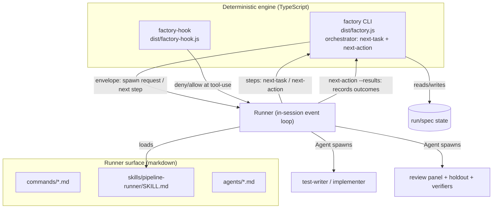

# Architecture Overview

This document describes the system context and the container-level structure of
the Dark Factory plugin. For the building blocks inside each container, see
[components.md](./components.md).

## System context

The factory sits between a person's PRD issue and a target GitHub repository. The
person writes requirements; the factory delivers merged pull requests on an
integration branch. It never touches `main` — promotion to `main` is human-owned
and out of scope.


The three external dependencies are: the **GitHub repo** (the PRD source and the
PR/issue target, reached via `gh`), the **Claude Code session** (which hosts the
runner and the `Agent` tool), and the **plugin data directory**
(`$CLAUDE_PLUGIN_DATA`), where all run and spec state lives — deliberately
outside the target repo so the holdout answer-key is unreadable from an implementer
worktree.

## The Model-A split (container view)

The plugin is two cooperating halves separated by a hard seam. This is the single
most important structural fact about the system.



**The CLI is the brain, and it owns ALL control flow.** `factory <subcommand>`
owns _all_ run-state writes, the spec gates, the deterministic verifier gates,
failure classification, the producer escalation ladder, the risk-invariant review
merge gate, PR creation — and the pipeline loop itself, exposed through ONE seam, the
**orchestrator** (`factory next-task` + `factory next-action`). It is deterministic and tested. It
**never spawns an agent**.

**A runner is the hands.** A thin runner steps the seam: it performs every
`Agent()` spawn the orchestrator's request names, collects the agents' raw output, and
feeds it back via `factory next-action --results`. It never decides a transition,
re-runs a gate, classifies a failure, or writes state by prose. ONE runner exists
(Decision 42): the in-session parallel event loop — every `factory` call runs
foreground in the invoking Claude Code session (one-driver-per-task by
construction) while the agents of up to `maxParallelTasks` tasks run in the
background.

The CLI is a **reporter + orchestrator + writer**, not a runner:

- **The orchestrator** — `next-task` (run-level: the ready set) and `next-action` (task-level: run a
  task's deterministic phases, emit a spawn request, and via `--results` record the
  agents' output into ONE state step). This is the only control-flow seam.
- **Reporter** subcommands (`spec`, `score`, `rescue scan`, `state`) emit one JSON
  envelope and write nothing.
- **Writer** subcommands (`spec` store, `rescue apply`, `scaffold`, `configure`,
  `run create`/`finalize`) record a result or an operator decision into state.

The six retired single-step writers (`run-task`, `advance`, `fail`,
`record-producer`, `record-holdout`, `record-reviews`) collapsed into the orchestrator.

Why this split exists, and what it buys, is the subject of
[explanation/model-a.md](../explanation/model-a.md).

## The run lifecycle

A run proceeds through four phases. The CLI provides the deterministic glue — and
the loop itself, behind the orchestrator — at each phase; the runner owns only the agent
spawns. The participant below is the runner (the in-session event loop).

```mermaid
sequenceDiagram
  participant O as Runner
  participant CLI as factory CLI (engine + orchestrator)
  participant A as Agents

  Note over O,CLI: Phase 0 — Preconditions
  O->>CLI: factory scaffold --repo o/n
  CLI-->>O: CI net + develop protection (or REFUSE)

  Note over O,CLI: Phase 1 — Spec (bounded generate ⇄ review)
  O->>CLI: factory spec resolve/gate/store
  CLI-->>O: envelope: generate | revise | review | stored | reuse
  O->>A: spawn spec-generator / spec-reviewer
  A-->>O: GenerateResult / ReviewVerdict JSON

  Note over O,CLI: Phase 2 — Create
  O->>CLI: factory run create --repo o/n --issue n
  CLI-->>O: RunState (tasks seeded, status running)

  Note over O,CLI: Phase 3 — Advance (run orchestrator picks a task, task orchestrator advances it)
  loop until document or finalize
    O->>CLI: factory next-task
    CLI-->>O: NextTask (work | traceability | document | finalize | pause)
    loop advance the ready task: preflight→tests→exec→verify→ship
      O->>CLI: factory next-action --task <t> [--results <prev>]
      CLI-->>O: NextAction (spawn request | done | pause)
      O->>A: spawn the agents the request names
      A-->>O: STATUS line / raw reviews
    end
  end

  Note over O,CLI: Phase 3b — Docs (when all tasks completed and /docs is applicable)
  O->>CLI: factory run docs
  CLI-->>O: DocsAction (scribe spawn request on staging-rooted worktree)
  O->>A: spawn scribe
  A-->>O: docs commit on staging
  O->>CLI: factory run docs --results <output>
  CLI-->>O: finalize (docs marked done; record merges commit onto staging)

  Note over O,CLI: Phase 4 — Completion
  O->>CLI: factory run finalize
  CLI-->>O: report + (on failed) PRD-issue fails comment + (on completed) staging-&lt;run-id&gt;→develop rollup (includes docs commit), then terminal
  O->>CLI: factory score / state --summary
```

### Per-task phase machine

Each task moves through a closed, ordered set of phases:

```
preflight → tests → exec → verify → ship
```

- **preflight** — set up the task worktree/branch; report-only.
- **tests** — producer phase: the `test-writer` commits failing tests first (TDD).
- **exec** — producer phase: the `implementer` commits the minimal implementation.
- **verify** — the merge gate: deterministic gates + holdout validation + the
  four-reviewer panel + verify-then-fix. Derives the merge gate verdict.
- **ship** — opens the task PR idempotently; in `live` mode serial-merges into the
  run's `staging-<run-id>` branch. The one phase that writes the terminal task status.
  It probes for a native GitHub merge queue and, when present, enqueues via
  `--auto`; otherwise it app-level squash-merges. The probe distinguishes a genuine
  "no merge queue" (a `404`) from a "couldn't tell" gh failure (auth, rate-limit,
  5xx, truncated body): the latter **throws** rather than silently degrading off a
  real merge queue. The merge writer catches that throw, logs a warning, and falls
  back to app-level squash — an observable, contained degrade (both paths squash;
  only `--auto` differs), never a crashed run.

When all tasks are terminal and the PRD would be `completed`, `factory next-task`
first schedules the run-level **PRD-traceability** phase on every non-debug run,
before docs (Decision 47). The runner runs `factory run traceability`, which spawns
the read-only `traceability-auditor` in a detached worktree to deliver one
met/partial/unmet verdict per numbered PRD requirement — judging only the run's whole
staging diff, never task statuses or review outcomes. `partial` verdicts pass but
surface as gaps in the report; any `unmet` condemns the run, so `finalize` blocks the
rollup and the docs phase never runs. A crashed audit retries once
(`MAX_TRACE_ATTEMPTS` = 2); a crash at the cap fails the run (unlike docs, it is not
best-effort). Only after the audit clears does `next-task` proceed to docs.

Then `factory next-task`
returns `document` instead of `finalize` — provided the repo keeps a `/docs`
directory and docs are not opted out (`package.json` `factory.docs.enabled !== false`)
and the run's docs phase isn't already `done`. The runner then runs `factory run docs`,
which emits a scribe spawn request for a staging-rooted worktree; the runner spawns the
`scribe` agent, then records the docs commit back via `factory run docs --results`. The
record merges/pushes the docs commit onto the staging branch. Only once docs are `done`
does `factory next-task` emit `finalize`. A docs failure suspends the run for a retry
(resumable via `/factory:resume`), bounded by `MAX_DOCS_ATTEMPTS` (2) — once the cap is
hit, docs are treated as best-effort and the run finalizes `completed` without a docs
commit instead of suspend-looping. On a `failed` run, or when docs are opted out, the
docs phase is skipped and `finalize` fires immediately (Decision 37).

The run-level **finalize** step is a _separate_ phase that runs once, after every
task is terminal and the docs phase (if applicable) is `done`: it builds the report,
and — on a `failed` run — posts one comment on the PRD issue listing the failed tasks
(Decision 36), or — **only when the whole PRD completed** (Decision 34) — ships the
`staging-<run-id> → develop` rollup (which now includes the docs commit, since it
landed on staging before finalize) then closes the PRD issue and deletes the per-run
branch before flipping the run terminal. A `failed` run leaves `develop` untouched
and keeps its branch.

## Data flow and state

All state lives under `$CLAUDE_PLUGIN_DATA` in two stores:

- **Durable spec store** — `specs/<repo>/<spec-id>/`, keyed by `(repo,
spec-id)` where `spec-id = "<issue>-<slug>"`. Reused across runs: re-running a
  PRD issue resolves the same spec.
- **Ephemeral run store** — `runs/<run-id>/`, holding `state.json`,
  `audit.jsonl`, `metrics.jsonl`, `report.md`, and the `holdouts/` and
  `reviews/` subdirs.
- **Per-repo current pointer** — a `current/<repo-key>` symlink names the active
  run _for that repo_, so concurrent runs against different repos never collide on
  one global pointer. It is CLI-ergonomics only: the human reporters resolve "the
  current run" from the caller's checkout, and no hook ever reads it. A legacy
  global `runs/current` pointer is still written for repo-less "most recent".
- **Producer worktrees** — `worktrees/<run-id>/<task-id>/`, a sibling of `runs/`.
  Because the path encodes `(run-id, task-id)`, a guard derives a write's run
  ownership straight from its target path rather than from any shared pointer (see
  [explanation/decisions.md](../explanation/decisions.md) Decision 30).

State writes are atomic (write-temp-then-rename) and lock-protected
(`proper-lockfile`). Crucially, **no gate verdict is ever stored** — every
pass/fail is re-derived from ground truth when needed
([explanation/derive-dont-store.md](../explanation/derive-dont-store.md)). The
state schema is in [reference/state-model.md](../reference/state-model.md).

## Build and deployment

The engine is shipped as two checked-in esbuild bundles
(`dist/factory.js`, `dist/factory-hook.js`), fully inlined so they run at a
user's site with no `node_modules`. `npm run verify` (typecheck → check:circular →
lint → test → build) is the release gate. There is no separate deploy: the plugin _is_ the
checked-in markdown surface plus the two bundles. See
[guides/build-and-verify.md](../guides/build-and-verify.md).

## Where the engine enforces invariants outside the CLI

Some invariants must hold at tool-use time, before any CLI call. These are the
`factory-hook` guards, wired into `hooks/hooks.json`: TCB write-denial, the
holdout-answer-key read guard, the secret-commit guard, branch protection, the
test-writer scope + ship gating guard, and the stop/subagent-stop gates. See
[reference/hooks.md](../reference/hooks.md).
</content>
