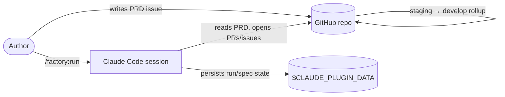
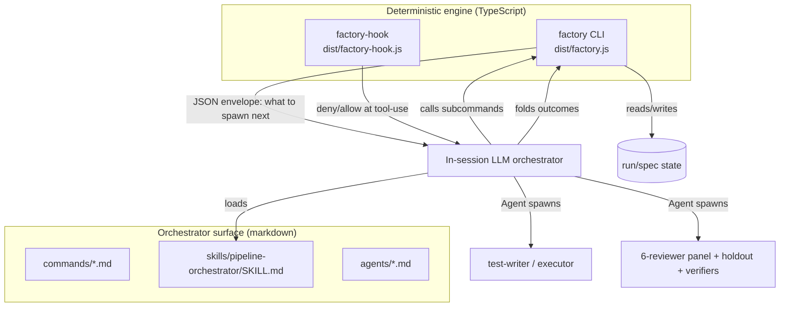
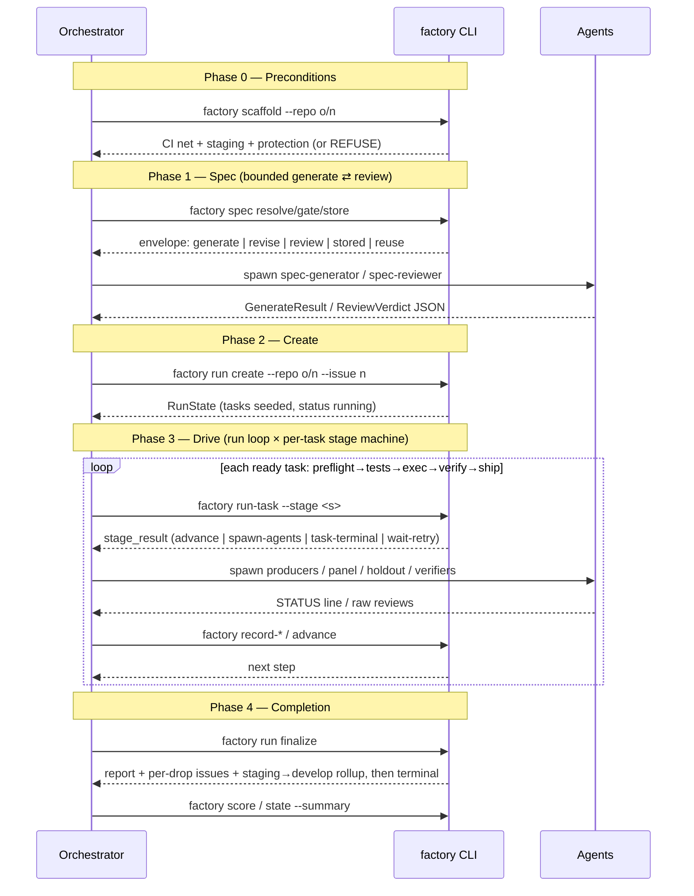

# Architecture Overview

This document describes the system context and the container-level structure of
the Dark Factory plugin. For the building blocks inside each container, see
[components.md](./components.md).

## System context

The factory sits between a person's PRD issue and a target GitHub repository. The
person writes requirements; the factory delivers merged pull requests on an
integration branch. It never touches `main` — promotion to `main` is human-owned
and out of scope.



The three external dependencies are: the **GitHub repo** (the PRD source and the
PR/issue target, reached via `gh`), the **Claude Code session** (which hosts the
orchestrator and the `Agent` tool), and the **plugin data directory**
(`$CLAUDE_PLUGIN_DATA`), where all run and spec state lives — deliberately
outside the target repo so the holdout answer-key is unreadable from an executor
worktree.

## The Model-A split (container view)

The plugin is two cooperating halves separated by a hard seam. This is the single
most important structural fact about the system.



**The CLI is the brain.** `factory <subcommand>` owns _all_ run-state writes, the
spec gates, the deterministic verifier gates, failure classification, the
producer escalation ladder, the risk-invariant review floor, and PR creation. It
is deterministic and tested. It **never spawns an agent**.

**The orchestrator is the hands.** It performs every `Agent()` spawn the CLI
reports, collects the agents' raw output, writes it to a file, and folds it back
via a writer subcommand. It never decides a transition, re-runs a gate,
classifies a failure, or writes state by prose.

The CLI is a **reporter + writer**, not a runner:

- **Reporter** subcommands (`run-task`, `spec`, `score`, `rescue scan`,
  `state`) emit one JSON envelope and write nothing (except `run-task --stage
ship`, which is terminal-by-construction and writes the ship outcome).
- **Writer** subcommands (`advance`, `drop`, `record-producer`,
  `record-holdout`, `record-reviews`, `rescue apply`, `configure`) fold an agent
  outcome (or an operator decision) into state in a single step and return the
  next step.

Why this split exists, and what it buys, is the subject of
[explanation/model-a.md](../explanation/model-a.md).

## The run lifecycle

A run proceeds through four orchestrator phases. The CLI provides the
deterministic glue at each phase; the orchestrator owns the agent spawns and the
loop.



### Per-task stage machine

Each task moves through a closed, ordered set of stages:

```
preflight → tests → exec → verify → ship
```

- **preflight** — set up the task worktree/branch; report-only.
- **tests** — producer stage: the `test-writer` commits failing tests first (TDD).
- **exec** — producer stage: the `task-executor` commits the minimal implementation.
- **verify** — the verifier floor: deterministic gates + holdout validation + the
  six-reviewer panel + verify-then-fix. Derives the floor verdict.
- **ship** — opens the task PR idempotently; in `live` mode serial-merges into
  `staging`. The one stage that writes the terminal task status.

The run-level **finalize** step is a _separate_ stage that runs once, after every
task is terminal: it builds the report, files one issue per drop, and ships the
`staging → develop` rollup before flipping the run terminal.

## Data flow and state

All state lives under `$CLAUDE_PLUGIN_DATA` in two stores:

- **Durable spec store** — `specs/<repo>/<spec-id>/`, keyed by `(repo,
spec-id)` where `spec-id = "<issue>-<slug>"`. Reused across runs: re-running a
  PRD issue resolves the same spec.
- **Ephemeral run store** — `runs/<run-id>/`, holding `state.json`,
  `audit.jsonl`, `metrics.jsonl`, `report.md`, and the `holdouts/` and
  `reviews/` subdirs. A `runs/current` symlink points at the active run.

State writes are atomic (write-temp-then-rename) and lock-protected
(`proper-lockfile`). Crucially, **no gate verdict is ever stored** — every
pass/fail is re-derived from ground truth when needed
([explanation/derive-dont-store.md](../explanation/derive-dont-store.md)). The
state schema is in [reference/state-model.md](../reference/state-model.md).

## Build and deployment

The engine is shipped as two checked-in esbuild bundles
(`dist/factory.js`, `dist/factory-hook.js`), fully inlined so they run at a
user's site with no `node_modules`. `npm run verify` (typecheck → lint → test →
build) is the release gate. There is no separate deploy: the plugin _is_ the
checked-in markdown surface plus the two bundles. See
[guides/build-and-verify.md](../guides/build-and-verify.md).

## Where the engine enforces invariants outside the CLI

Some invariants must hold at tool-use time, before any CLI call. These are the
`factory-hook` guards, wired into `hooks/hooks.json`: TCB write-denial, the
holdout-answer-key read guard, the secret-commit guard, branch protection, the
test-writer scope + ship gating guard, and the stop/subagent-stop gates. See
[reference/hooks.md](../reference/hooks.md).
</content>
