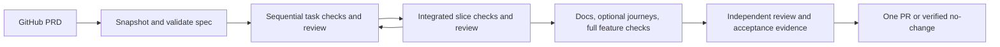

# Architecture overview

Factory v2 delivers one PRD on one feature branch, with sequential tasks and one
PR. It separates agent judgment from durable control flow. The CLI owns all state
transitions; the session runner dispatches the exact persisted attempt.

```mermaid
flowchart LR
  PRD[GitHub PRD] --> Spec[Snapshot and validate spec]
  Spec --> Task[Sequential task checks and review]
  Task --> Slice[Integrated slice checks and review]
  Slice --> Task
  Slice --> Feature[Docs, optional journeys, full feature checks]
  Feature --> Review[Independent review and acceptance evidence]
  Review --> Delivery[One PR or verified no-change]
```

## Durable state

`$CLAUDE_PLUGIN_DATA/runs-v2/<id>/state.json` stores the complete spec, accepted
checkpoints, active attempt, answers, repair counters and delivery observation.
Atomic state writes are serialized by a repository lock. Agents' raw results are
staged per role under `staged-v2/`, validated, and journaled once accepted.
`ledger.md` is the human-readable audit.

An attempt binds its driver, stage, spec digest, base SHA, HEAD SHA and worktree.
Repeated next-action calls wait for the existing attempt. A fresh process resumes
from disk and may consume the staged results of an earlier driver. Explicit
recovery consumes a complete staged result, redispatches only a partial panel's
missing roles, or retires a stopped worker's lease, preserving work. Stale
results are rejected.
A parked run never resumes merely because time elapsed or quota recovered.

## Specs and integration

Production specs live under `$CLAUDE_PLUGIN_DATA/v2/specs/`. Each `feature.json`
freezes the PRD, base commit, repository contracts and task graph. Run creation
revalidates live PRD/base inputs. Every requirement has an ID and coverage mapping.
Tasks have exact safe paths, explicit shared-file dependencies and contiguous
slice membership. There is no file-count ceiling.

One worktree at `.claude/worktrees/feature-<id>` accumulates accepted work.
Review attempts receive detached snapshots of exact commits. The runner must
not request native Agent worktree isolation. Accepted work is never reset.

## Verification and repairs

Nonexempt tasks establish a passing baseline, commit meaningful failing assertions,
then implement. TDD is checked on the unsquashed history. The exemption comes from
the frozen task spec or baseline package manifest, not producer-edited settings.
Executed-test counts are required; unsupported reporters stop with a clear error.

Tasks receive tests/type/lint and quality review. Slice and feature boundaries
run broader integrated gates and the review panel, adding database review when
the diff requires it. Citations are checked before independent confirmation.
Acceptance evaluation is independent, covers every requested ID, and sees all
criteria. Producer claims and unrelated green tests cannot establish acceptance.

Execution has three repair passes per boundary; spec generation has five revisions.
A clean base merge triggers full verification without spending a producer repair
pass. Conflicts preserve both sides for forward repair. CI waiting has a deadline
and consumes no implementation pass.

Final acceptance persists the verified feature HEAD and spec digest. Delivery must
match both, including after an interruption between Git integration and the state
write. An invalid staged result parks the run with its files retained; explicit
recovery consumes a corrected result or retires the attempt and schedules
replacement evidence without discarding work.

## Delivery and protection

The engine recovers PR identity by branch, pushes normally and observes the exact
reviewed HEAD. Live runs complete only after an observed merge. No-ship and debug
runs end ready for review. A verified empty feature completes without an empty PR.
Merge observation precedes no-change detection, including after interrupted delivery.

Scaffolding requires a stable strict branch profile. Existing sufficient protection
is untouched. Strengthening updates only required status checks and preserves
existing check app bindings and unrelated review/admin/restriction policy.
No run lifecycle transition changes branch protection.

## Version boundary

This is a clean major break. Old run/spec artifacts remain available but cannot
execute or migrate automatically. Retired orchestration modules remain in source
for diagnosis and regression coverage, outside production execution dispatch.
See [CLI reference](../reference/cli.md) and [release ledger](../proposals/sequential-feature-delivery.md).
