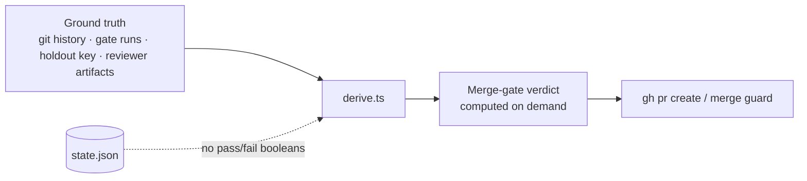

# Derive, Don't Store

The run state file (`state.json`) holds **no gate pass/fail booleans**. Every
quality verdict — each deterministic gate, the holdout, the merge gate — is recomputed
from ground truth at the moment it is needed, never read back from a field. This
document explains the property and why it is the load-bearing trust mechanism of
the whole pipeline.

## The threat it defends against

The factory runs agents, and agents are the producers of the very work being
gated. If a "this gate passed" boolean lived in state, the cheapest way for an
agent to ship bad code would be to _write that boolean_ — not to fix the code. An
unattended pipeline whose value proposition is trust cannot have a forgeable
pass-field. The defense is structural: **there is no field to forge.**

## What is derived vs what is stored

The line is sharp and principled:

| Recomputed every time (never stored)                         | Stored (it _is_ ground truth)                        |
| ------------------------------------------------------------ | ---------------------------------------------------- |
| Each deterministic gate's pass/fail (test, tdd, coverage, …) | Each reviewer's own panel verdict + artifact pointer |
| The conjunctive **merge gate** verdict (gate ∧ holdout ∧ panel)   | The producer dial: `risk_tier`, `escalation_rung`    |
| The panel **unanimity** verdict                              | Git/PR pointers, the failure classification          |
| `tdd_exempt` (read from `tasks.json` / `package.json`)       | Task `status` and `depends_on`                       |

The distinction: a deterministic gate's result is a _function of ground truth_
(the git history, the test run, the holdout key), so storing it would only create
a stale, forgeable copy. A reviewer's verdict, by contrast, **is** the ground
truth of that reviewer's opinion — there is nothing more authoritative to derive
it from — so it is stored. The _merge gate_ (unanimity over those stored opinions) is
then derived from them (`derive.ts`).

## Where the derivation happens

`deriveMergeGateVerdict` is the single function that computes the merge gate from evidence,
and it is called at every point a verdict is needed — including inside the
`pipeline-guards` hook that gates `gh pr create` and `gh ... merge`. The PR cannot
be opened on a trusted state flag; it is opened only when the merge gate _re-derives_
clear from the actual worktree, gate runs, and confirmed reviewer blockers. The
hook and the driver share the same derivation, so the guard cannot disagree with
the engine.

## The sanctioned exceptions

Two stored values look like exceptions but are not:

- **Reviewer panel verdicts** — stored because each is itself ground truth (a
  judgment reviewer's recorded opinion after verify-then-fix). The schema is
  explicit that these are _not_ trusted booleans for any deterministic gate.
- **Holdout verdicts** — stored in a verdict store because they come from an
  independent answer-key validation whose inputs are withheld from the producer;
  re-deriving them would mean re-running the validation, and the validation itself
  is the ground truth. They fold into the same `deriveMergeGateVerdict`.

Both are flagged in the source as deliberate, narrow carve-outs (Δ V), not drift.

## What this buys

- **Forgery resistance** — the central property. No agent can fake a passing gate
  by writing state; the only way to make the merge gate clear is to make the code
  actually clear.
- **No stale verdicts** — a verdict computed from current ground truth cannot be
  out of date with respect to a later commit. A re-drive recomputes everything.
- **A self-consistent guard** — the merge guard and the driver reach the same
  conclusion because they run the same derivation over the same evidence.

## See also

- [Model A](./model-a.md) — derive-don't-store is what makes the brain/hands seam
  forgery-resistant.
- [The verifier and the risk-invariant merge gate](./verifier.md) — how the merge gate is
  composed and confirmed.
- [State model](../reference/state-model.md) — the `TaskState` schema and the
  fields it deliberately does _not_ carry.
