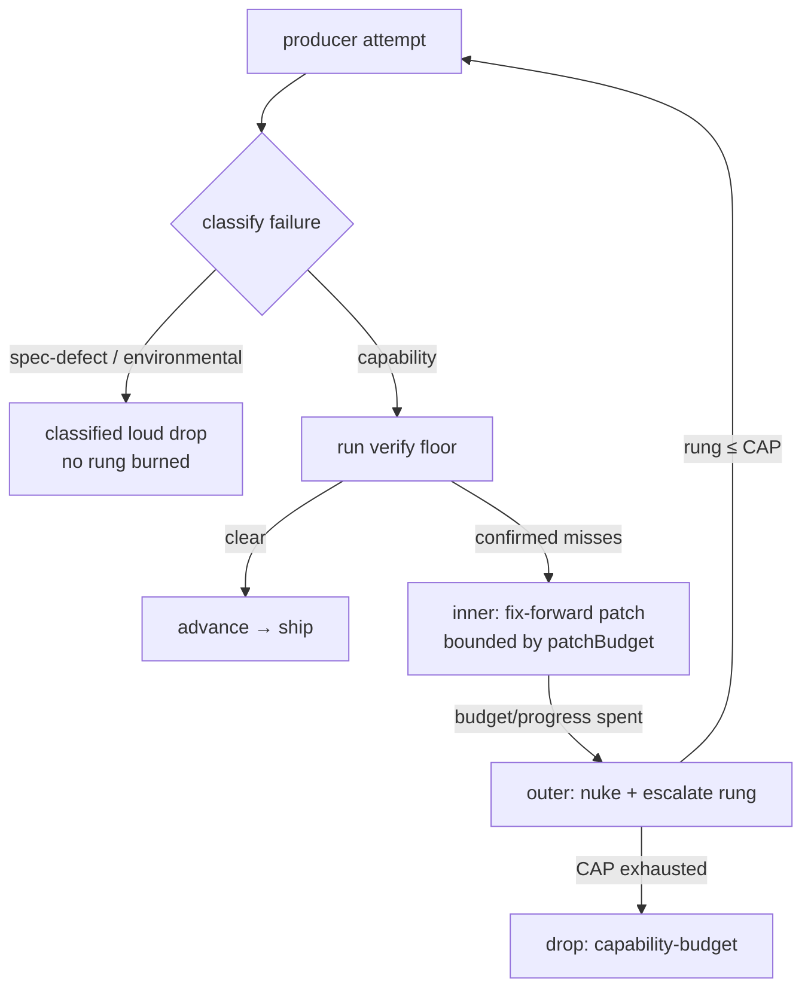

# The Producer Escalation Ladder

When a producer's output fails the floor, the factory does not blindly retry. It
runs a bounded, structured escalation — the **ladder** — governed by three rules:
classify before retry, change a variable each rung, and cap the retries before a
loud classified drop. The ladder is not one module: the cap lives in
`src/producer/escalation.ts` (`ESCALATION_CAP`), the per-rung model + effort dial in
`src/producer/model-dial.ts` (`dialForRung`), and the rung-bump-or-drop decision in
`src/driver/transitions.ts` (`escalateOrDrop`). This document explains why each rule
exists.

## The shape

The ladder is two nested loops:

- **Outer loop** — the bounded nuke-and-retry over rungs `0..CAP` (CAP = 4 extra
  attempts ⇒ 5 total). Each rung is a fresh start that changes a variable.
- **Inner loop** — fix-forward: after a `done` producer spawn, the floor runs; on
  confirmed misses the producer is re-spawned to _patch the specific remaining
  blockers_ (not nuked), bounded by a patch budget and by making progress.

## Rule 1 — Classify before retry

Not every failure is worth retrying. Before any rung is burned, the failure is run
through `classifyFailure`. A failure that is structural — a spec defect (e.g. an
untestable acceptance criterion), a structurally-unfixable gate, or an
environmental blocker — routes _straight_ to a classified loud drop. Retrying it
only wastes the budget on a determined failure.

Only a capability failure — a fixable miss, a verifier error, a producer that ran
out of context — re-executes. This is why drops carry a closed failure class
(`capability-budget`, `spec-defect`, `blocked-environmental`): the class tells the
human what to do, and tells the ladder whether to retry.

## Rule 2 — Change a variable each rung

A blind re-roll (re-running the same producer on the same model with the same
context) wastes attempts — if it failed once, it will likely fail again. So each
escalation rung must change something. The dial (`dialForRung`) climbs the **model
to its ceiling first, then the effort/reasoning level**:

- **Rung 0** — the model dialed for the task's risk tier, fresh context, default effort.
- **Rung 1** — the _same_ dialed model, _fresh_ context (the clean slate is the
  change), default effort.
- **Rung ≥ 2** — escalation, with injected prior-failure context. The model **jumps
  straight to the ceiling** (the `high`-tier `producerModels` entry — Opus by
  default) on the first escalation rung, then the effort climbs along a hardcoded
  `["xhigh", "max"]` ladder. A task whose dialed model already _is_ the ceiling (a
  high-risk task) skips the model-jump rung and begins climbing effort immediately.

Concrete, over rungs 0–4 (CAP = 4):

| starting tier | rung 0 | rung 1 | rung 2       | rung 3       | rung 4        |
| ------------- | ------ | ------ | ------------ | ------------ | ------------- |
| low / medium  | base   | base   | **Opus**     | Opus · xhigh | Opus · max    |
| high (= Opus) | Opus   | Opus   | Opus · xhigh | Opus · max   | Opus · max \* |

\* Nothing exists above `max` effort, so an already-ceiling task's final rung changes
only the accumulated prior-failure context — the ladder saturates honestly.

The ceiling model comes from the same `quota.producerModels` config map — no new
literal, no new knob — so a config override flows through every rung; the effort
ladder is a hardcoded constant, consistent with the hardcoded `ESCALATION_CAP`. The
dial is the only place the `risk_tier` value acts — it sets the producer's starting
model and thus how many rungs separate it from the ceiling. (The verifier floor is
risk-invariant; see [verifier.md](./verifier.md).)

## Rule 3 — Cap, then drop loud

The retries are capped (CAP = 4 past the starting rung, i.e. 5 attempts total —
raised from 2 so a hard task gets the full model→effort climb before a drop; see
`jfa94/outsidey#231`). The cap is SHARED across producer failures and reviewer
send-backs — one `escalation_rung` counter spans both. When the cap is exhausted with
the floor still blocked, the task is dropped with `capability-budget` and a reason — a
sixth attempt never spawns. Every terminal path of the ladder is loud and classified:
success is an `advance`, every failure is a `taskDropped`. There is no silent return.

## The inner fix-forward loop

Nuking the whole producer on every miss is wasteful when only a couple of confirmed
blockers remain. So before escalating, the ladder patches forward: it re-spawns the
producer over the _specific_ remaining confirmed blockers (folded into the prompt),
re-verifies, and repeats — bounded by the patch budget and by the requirement that
each pass reduce the blocker count. When the budget or progress is spent, the outer
loop nukes and escalates the model. This keeps cheap, targeted fixes cheap and
reserves the expensive model escalation for genuine capability shortfalls.

## What a drop becomes

A dropped task is terminal. At run finalize, every drop is surfaced as a single
deduped comment on the originating PRD issue, listing each dropped task with its
failure class, failure reason, and unmet acceptance criteria (Decision 36 retired
the old per-drop GitHub issues), plus a line in the run report. Because `develop`
receives only whole PRDs (Decision 34), any drop makes the run `failed`: `develop`
is left untouched and the PRD stays open, with the run's `staging-<run-id>` branch
banked for [rescue](../guides/rescue-a-stalled-run.md). Nothing is papered over. See
[../guides/run-the-pipeline.md](../guides/run-the-pipeline.md).
</content>
