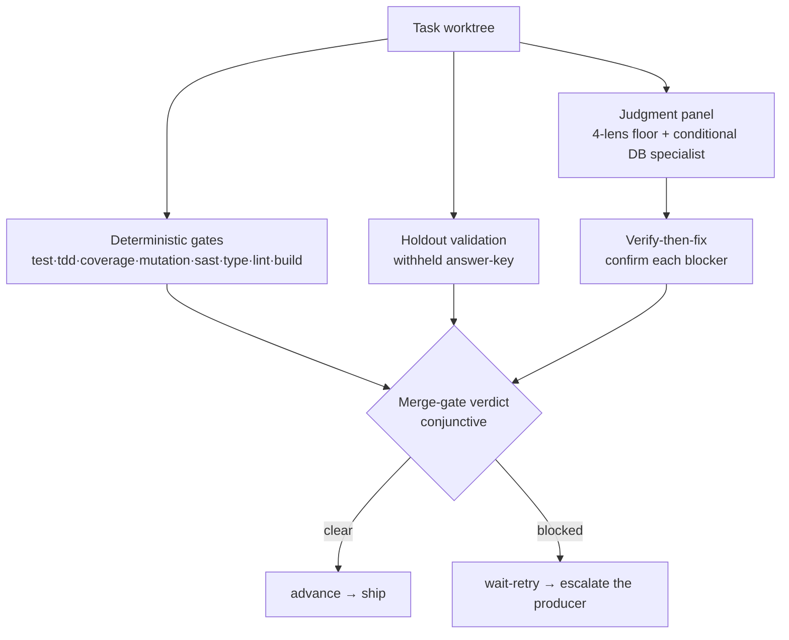

# The Verifier and the Risk-Invariant Merge Gate

The verifier is the gate between a producer's output and a shipped PR. It is a
**two-layer merge gate**: a deterministic machine-checkable layer and a judgment layer.
A task ships only when the conjunction of both clears. This document explains the
shape of the merge gate and the two design choices that distinguish it — the
risk-invariant panel and verify-then-fix.

## Two layers



- **Deterministic layer** (`src/verifier/deterministic`) — the `GateRunner` runs
  each enabled strategy, collects evidence, and derives a conjunctive verdict. See
  [../reference/automated-gates.md](../reference/automated-gates.md). It is folded into
  the merge gate as gate evidence.
- **Holdout** (`src/verifier/holdout`) — a subset of the acceptance criteria is
  withheld from the producer and validated independently after the fact, guarding
  against work tailored to the visible target. Folded into the merge gate as a
  `holdout` gate evidence entry. The withheld answer-key is stored **task-keyed**;
  the validator's parsed **verdicts** are stored **rung-keyed** — see
  [Rung-keyed holdout verdicts](#rung-keyed-holdout-verdicts-s1) below.
- **Judgment layer** (`src/verifier/judgment`) — a panel of reviewers, each
  applying a current best-practice lens, whose confirmed blockers contribute to the
  merge gate.

The merge gate is **conjunctive**: every gate that ran must pass, the holdout must
clear, and the panel must be unanimous. An empty-evidence (all-skipped) sweep
fails — "nothing ran" is never "passed".

## The risk-invariant panel (Decision 26)

A natural-seeming design would size the review panel to the work's risk — a light
panel for a copy tweak, a heavy one for an auth change. The factory deliberately
does **not** do this for the merge gate. Every reviewer runs on every task:

- `implementation-reviewer` — spec alignment: does the code address the spec, not
  just pass the tests?
- `quality-reviewer` — adversarial code quality, plus the folded security,
  architecture, and type-design dimensions (Decision 43); Codex is the preferred
  executor when available.
- `silent-failure-hunter` — swallowed errors, log-only catches, fallbacks that
  mask failure as success.
- `systemic-failure-reviewer` — the cross-stage lens: stuck states, invariants
  without a repair path, unsafe recovery, and over-pinned cross-stage contracts —
  defects that span multiple files or pipeline stages that no line-level reviewer
  sees.

A fifth reviewer, `database-design-reviewer`, is a **content-conditional specialist**
appended to the panel only when the task diff touches relational-schema files
(Decision 51). This does not weaken risk-invariance: the trigger is a deterministic
fact about diff _content_ — `touchesDatabase` (`src/verifier/judgment/db-detect.ts`)
matches the changed paths against built-in globs (`migrations/`, `db/migrate/`,
`alembic/versions/`, `drizzle/`, `schema.prisma`, `*.sql`) — not a risk-tier judgment,
and it is strictly **additive**: the four-lens floor always runs, and a DB-touching
task gets floor + specialist. Review only ever gets stricter. `panelRolesFor`
(`src/verifier/judgment/panel.ts`) is the single sanctioned sizing seam — both the
spawn site and the roster-enforcement site derive the expected roster through it, so
they cannot disagree (derive-don't-store: the DB fact is re-derived from the same
worktree tip at both, never persisted).

Risk does not change _who_ reviews; it changes _the producer's starting model and
escalation budget_ (see [producer-ladder.md](./producer-ladder.md)). The single
`risk_tier` dial sizes the producer, not the verifier.

Why invariant? Because under-scrutiny is the expensive failure mode for an
unattended pipeline. A misclassified high-risk change reviewed by a narrow panel
ships a real defect silently. Making the merge gate risk-invariant removes
classification error from the verifier's blast radius: the panel is the panel,
regardless of how the task was tiered. The reviewer model is fixed (not
quota-routed) for the same reason — review quality must not degrade under quota
pressure.

"The panel is the panel" is enforced structurally, not just intended. The merge-gate
verdict is unanimity over whatever reviews arrive, so a partial all-approve **subset**
of the expected roster would otherwise clear it. At the record seam (`enforcePanelRoster`,
`src/orchestrator/record.ts`) any missing role is synthesized as a `verdict:"error"`
review and any unknown reviewer name is demoted to `error` — both fail the gate loudly,
so an incomplete panel can never pass. The expected roster is not hard-coded four names:
`enforcePanelRoster` takes the re-derived roster (`panelRolesFor`, floor plus the
conditional `database-design-reviewer`), so on a DB-touching task a missing specialist
review fails the gate exactly as a missing floor role does. The cross-vendor reviewer is an executor of a
roster role (quality-reviewer via Codex), never an extra name, so it stays additive and
optional; supplying it does not change the required roster.

Cross-vendor availability is **probed, not assumed** (Decision 44): the engine runs
`codex --version` (memoized, `src/verifier/judgment/codex-probe.ts`) and stamps the
verify spawn manifest with `cross_vendor: {status:"present",model} | {status:"absent",reason}`.
The runner executes the quality-reviewer via `codex exec` when present and reports an
honest `crossVendorAbsent` reason when it can't. Absence is surfaced per shipped task in
`report.md` (`## Review independence`) and the run summary; `review.requireCrossVendor`
(`warn` default) escalates to `block`, which demotes the quality-reviewer to
`verdict:"error"` so the merge gate cannot pass single-vendor.

## How the panel and holdout inspect a task

Both the review panel and the holdout-validator are spawned against the **task
worktree** and inspect the change with:

```bash
git -C <taskWorktree> diff origin/staging-<run-id>
```

The diff base is the run's per-run integration branch `origin/staging-<run-id>`
(Decision 33) — the **remote-tracking ref**, not a local branch. This is
load-bearing: `createTaskWorktree` (`src/git/worktree.ts`) creates the worktree with
`git worktree add -b <branch> <path> origin/staging-<run-id>`, so it forks from that
remote-tracking ref (fetched fresh at creation) and **never creates or maintains a
local staging branch**. A bare `git diff` against a local name therefore resolves to
a stale or absent ref — it degraded silently (a local branch
sometimes happened to be current, and reviewers Read files directly).
`origin/staging-<run-id>` is exactly the fork point, so it is the deterministic base
for every "inspect the diff" instruction. (Same root cause as the worktree-base
invariant — see [decisions.md Decision 12](./decisions.md#decision-12-staging-branch-as-integration-point).)

A reviewer's lens is **not** delivered as a per-run prompt file. The spawn
request carries a `prompt_ref` of `reviews/prompts/<role>.md` for each reviewer
purely to satisfy the request schema's non-empty constraint — the runner never reads it
and nothing writes it. The runner builds the reviewer prompt **inline** from the
reviewer's `agents/<role>.md` definition plus the shared
`skills/review-protocol/SKILL.md` contract. Only a **producer's** `prompt_ref`
points at a real per-run artifact a runner Reads (the `ProducerContext`).

## Rung-keyed holdout verdicts (S1)

The holdout verdict store (`src/verifier/holdout/verdict-store.ts`) is keyed by
`(runId, taskId, rung)`, where `rung` is the task's escalation rung — verdict files
land at `runs/<run>/holdouts/<task>.r<rung>.verdicts.json`. (The answer-key store
stays **task-keyed**: the withheld criteria text is stable across escalations.)

The keying is load-bearing for the **crash-resume fast-path** in
`makePhaseHandlers` (`src/orchestrator/handlers.ts`). On a resumed holdout task the
handler checks whether verdicts already exist on disk before deriving the merge gate
without re-spawning the validator panel. Were the store task-keyed, a verdict written
at a **prior** rung would survive an escalation bump and satisfy that check — the
implementation is at a new rung, but a stale verdict clears it. With rung-keying, the
current-rung verdict file is simply **absent** after a bump, so the fast-path
**fails closed** and re-spawns the panel against the new implementation. A prior
rung's files become inert rather than misleading.

## Verify-then-fix (Decision 27)

A reviewer's raw "this is a blocker" cannot be trusted to act on directly: LLM
reviewers hallucinate findings. So every blocking, citable finding (one carrying
both a `file` and a `line`) is independently confirmed before it can block the
task:

1. **Citation-verify** — the finding's quoted code is checked against the actual
   worktree source. An uncitable finding (missing `file`/`line`, or a quote that
   does not match) is failed. One rescue exists (Decision 44): a single-line quote
   that misses at the cited line but matches **exactly one** line elsewhere in the
   file is relocated there (`RELOCATE relocated_ok` in the audit) instead of
   dropped — reviewers are frequently right about the code and off by a few lines.
   Zero or multiple matches, multi-line quotes, and whitespace-only quotes stay
   fail-closed. Confirmation still keys on the reviewer's **cited** line (what the
   verifier agent saw); the relocated line is what reaches the producer.
2. **Independent confirmation** — a separate finding-verifier, whose identity
   differs from every reviewer, adversarially tries to refute the finding against
   the code (`{ holds, note }`). A finding that does not hold is discarded.
   The verifier is **claim-only** (anti-anchoring, Decision 44): its prompt is
   built from `{reviewer, severity, claim, file, line, quote}` — never the
   reviewer's `description` reasoning chain, so it can't be led to the same
   wrong conclusion.

Only confirmed blockers reach the producer. This is why the runner must run a
finding-verifier for each blocking + citable finding and feed its verdict back: a
kept citable blocker with no recorded verdict makes the merge gate **fail closed** (the
verify record inside `factory next-action --results` rejects it) — independence is
preserved by construction, never by trust.

A reviewer that fails to produce a usable verdict is an `error`, not a silent
`approve` — an unresolved verifier error never auto-ships.

## How a blocked merge gate feeds back

When the merge gate blocks, the verify record returns a bounded `wait-retry`. The orchestrator
(not the runner) classifies it as `merge-gate-blocked` and escalates the producer
ladder: the rung is bumped, the reviewers are cleared, and a fresh panel runs after
the producer re-attempts. A structurally-unfixable gate or an environmental blocker
is classified-before-retry and fails immediately without burning a rung. See
[producer-ladder.md](./producer-ladder.md).

The human-facing block reason names what actually failed. A single shared helper
(`mergeGateBlockReason`, `src/core/state/derive.ts`) is the source of truth for both
live verify paths — the fresh-review path (`runPanel` in `panel-run.ts`) and the
resume / merge-resync re-entry path (`handlers.ts`) — so the two cannot drift apart.
It inspects both halves of the merge gate: failing deterministic gates are named with
their detail (e.g. `failed gates: type (tsc exit=1)`), an empty gate-evidence set is
called out explicitly (`no deterministic gate evidence`) rather than masked, and
blocked or errored reviewers are listed. Only when nothing specific is identifiable
does it fall back to the generic `merge gate not unanimous`. This is what surfaces a
fail-closed gate (a missing local tool bin, or a gate sweep that produced no
evidence) instead of hiding it behind unanimity wording.

## Derive, don't store

No merge gate verdict, panel verdict (as a merge gate), or gate verdict is persisted. The
merge gate is re-derived from evidence every time it is needed — including inside the
`pipeline-guards` hook that gates `gh pr create`/`merge`. The one stored judgment
is each individual reviewer's panel verdict (that opinion is itself ground truth);
the merge gate (unanimity) is computed from those. See
[derive-dont-store.md](./derive-dont-store.md).
</content>

## Why gates exec local bins, never `npx`

The command-running gates (`test`, `type`, `lint`, `mutation`) resolve and exec
the worktree's own `node_modules/.bin/<tool>` (see
[the gate-resolution reference](../reference/automated-gates.md#how-a-command-gate-resolves-its-tool)),
never `npx <tool>`. Under corepack with a `packageManager: pnpm@…` field
(node ≥ 24), a bare `npx <tool>` bypasses the installed `node_modules/.bin` and
resolves a remote registry package of the same name instead — e.g. `npx tsc`
fetches an unrelated `tsc` decoy and exits 1, a false type-gate failure
independent of the code under test. Executing the local bin directly is
package-manager-agnostic and never touches the network; when no local bin
resolves the gate fails closed rather than falling back to `npx`.
