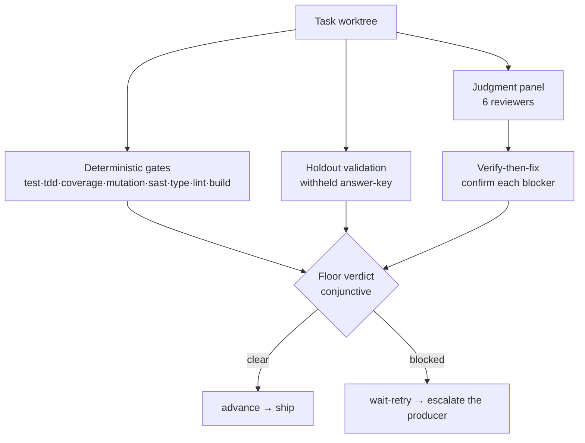

# The Verifier and the Risk-Invariant Floor

The verifier is the gate between a producer's output and a shipped PR. It is a
**two-layer floor**: a deterministic machine-checkable layer and a judgment layer.
A task ships only when the conjunction of both clears. This document explains the
shape of the floor and the two design choices that distinguish it — the
risk-invariant panel and verify-then-fix.

## Two layers



- **Deterministic layer** (`src/verifier/deterministic`) — the `GateRunner` runs
  each enabled strategy, collects evidence, and derives a conjunctive verdict. See
  [../reference/quality-gates.md](../reference/quality-gates.md). It is folded into
  the floor as gate evidence.
- **Holdout** (`src/verifier/holdout`) — a subset of the acceptance criteria is
  withheld from the producer and validated independently after the fact, guarding
  against work tailored to the visible target. Folded into the floor as a
  `holdout` gate evidence entry.
- **Judgment layer** (`src/verifier/judgment`) — a panel of reviewers, each
  applying a current best-practice lens, whose confirmed blockers contribute to the
  floor.

The floor is **conjunctive**: every gate that ran must pass, the holdout must
clear, and the panel must be unanimous. An empty-evidence (all-skipped) sweep
fails — "nothing ran" is never "passed".

## The risk-invariant panel (Decision 26)

A natural-seeming design would size the review panel to the work's risk — a light
panel for a copy tweak, a heavy one for an auth change. The factory deliberately
does **not** do this for the floor. Every reviewer runs on every task:

- `implementation-reviewer` — spec alignment: does the code address the spec, not
  just pass the tests?
- `quality-reviewer` — adversarial code quality (Codex is the preferred executor
  when available).
- `architecture-reviewer`, `security-reviewer`, `silent-failure-hunter`,
  `type-design-reviewer`.

Risk does not change _who_ reviews; it changes _the producer's starting model and
escalation budget_ (see [producer-ladder.md](./producer-ladder.md)). The single
`risk_tier` dial sizes the producer, not the verifier.

Why invariant? Because under-scrutiny is the expensive failure mode for an
unattended pipeline. A misclassified high-risk change reviewed by a narrow panel
ships a real defect silently. Making the floor risk-invariant removes
classification error from the verifier's blast radius: the panel is the panel,
regardless of how the task was tiered. The reviewer model is fixed (not
quota-routed) for the same reason — review quality must not degrade under quota
pressure.

## How the panel and holdout inspect a task

Both the review panel and the holdout-validator are spawned against the **task
worktree** and inspect the change with:

```bash
git -C <taskWorktree> diff origin/staging-<run-id>
```

The diff base is the run's per-run integration branch `origin/staging-<run-id>`
(Decision 33) — the **remote-tracking ref**, not a local branch. This is
load-bearing: `createTaskWorktree` (`src/git/worktree.ts`) creates the worktree with
`git worktree add -b <branch> <path> origin/staging-<run-id>`, so it forks from that
remote-tracking ref (fetched fresh at creation) and **never creates or maintains a
local staging branch**. A bare `git diff` against a local name therefore resolves to
a stale or absent ref — it degraded silently in session mode (a local branch
sometimes happened to be current, and reviewers Read files directly) and would
hard-error in workflow mode (the background Workflow never checks out the branch).
`origin/staging-<run-id>` is exactly the fork point, so it is the deterministic base
for every "inspect the diff" instruction. (Same root cause as the worktree-base
invariant — see [decisions.md Decision 12](./decisions.md#decision-12-staging-branch-as-integration-point).)

A reviewer's lens is **not** delivered as a per-run prompt file. The spawn
manifest carries a `prompt_ref` of `reviews/prompts/<role>.md` for each reviewer
purely to satisfy the manifest schema's non-empty constraint — no driver reads it
and nothing writes it. Both drivers build the reviewer prompt **inline** from the
reviewer's `agents/<role>.md` definition plus the shared
`skills/review-protocol/SKILL.md` contract. Only a **producer's** `prompt_ref`
points at a real per-run artifact a driver Reads (the `ProducerContext`).

## Verify-then-fix (Decision 27)

A reviewer's raw "this is a blocker" cannot be trusted to act on directly: LLM
reviewers hallucinate findings. So every blocking, citable finding (one carrying
both a `file` and a `line`) is independently confirmed before it can block the
task:

1. **Citation-verify** — the finding's quoted code is checked against the actual
   worktree source. An uncitable finding (missing `file`/`line`, or a quote that
   does not match) is dropped.
2. **Independent confirmation** — a separate finding-verifier, whose identity
   differs from every reviewer, adversarially tries to refute the finding against
   the code (`{ holds, note }`). A finding that does not hold is discarded.

Only confirmed blockers reach the producer. This is why the driver must run a
finding-verifier for each blocking + citable finding and feed its verdict back: a
kept citable blocker with no recorded verdict makes the floor **fail closed** (the
verify fold inside `factory drive --results` rejects it) — independence is
preserved by construction, never by trust.

A reviewer that fails to produce a usable verdict is an `error`, not a silent
`approve` — an unresolved verifier error never auto-ships.

## How a blocked floor feeds back

When the floor blocks, the verify fold returns a bounded `wait-retry`. The coroutine
(not the driver) classifies it as `floor-blocked` and escalates the producer
ladder: the rung is bumped, the reviewers are cleared, and a fresh panel runs after
the producer re-attempts. A structurally-unfixable gate or an environmental blocker
is classified-before-retry and drops immediately without burning a rung. See
[producer-ladder.md](./producer-ladder.md).

The human-facing block reason names what actually failed. A single shared helper
(`floorBlockReason`, `src/core/state/derive.ts`) is the source of truth for both
live verify paths — the fresh-review path (`runPanel` in `panel-run.ts`) and the
resume / merge-resync re-entry path (`handlers.ts`) — so the two cannot drift apart.
It inspects both halves of the floor: failing deterministic gates are named with
their detail (e.g. `failed gates: type (tsc exit=1)`), an empty gate-evidence set is
called out explicitly (`no deterministic gate evidence`) rather than masked, and
blocked or errored reviewers are listed. Only when nothing specific is identifiable
does it fall back to the generic `floor not unanimous`. This is what surfaces a
fail-closed gate (a missing local tool bin, or a gate sweep that produced no
evidence) instead of hiding it behind unanimity wording.

## Derive, don't store

No floor verdict, panel verdict (as a floor), or gate verdict is persisted. The
floor is re-derived from evidence every time it is needed — including inside the
`pipeline-guards` hook that gates `gh pr create`/`merge`. The one stored judgment
is each individual reviewer's panel verdict (that opinion is itself ground truth);
the floor (unanimity) is computed from those. See
[derive-dont-store.md](./derive-dont-store.md).
</content>
