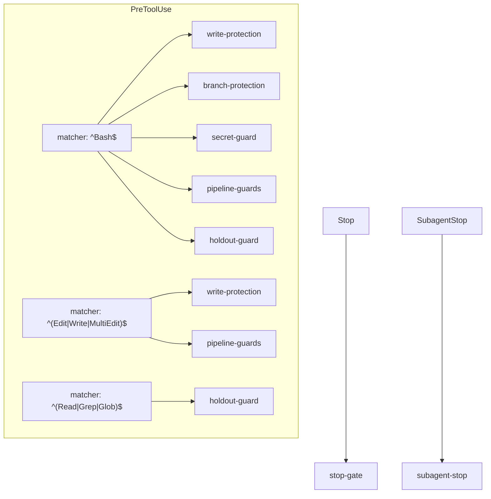

# Hooks Reference

The `factory-hook` dispatcher (`dist/factory-hook.js`, built from `src/hooks/`)
enforces invariants at Claude Code tool-use time, independent of any CLI call.
It is wired into `hooks/hooks.json` and invoked as `factory-hook <name>`. Each
guard is a separate, unit-testable function dispatched from the frozen registry in
`src/hooks/main.ts`.

Like the CLI: no args / `--help` lists the hooks and exits `0`; an unknown hook
exits `2`.

## The guards

| Hook                | Fires on                                    | What it does                                                                                                                                                                                                                                                                                                                                                        |
| ------------------- | ------------------------------------------- | ------------------------------------------------------------------------------------------------------------------------------------------------------------------------------------------------------------------------------------------------------------------------------------------------------------------------------------------------------------------- |
| `branch-protection` | PreToolUse `Bash`                           | Block destructive git ops on protected branches.                                                                                                                                                                                                                                                                                                                    |
| `secret-guard`      | PreToolUse `Bash`                           | Block a `git commit`/`push` that phases a known secret shape, and deny the redirection bypass forms that would decouple the scanned index/repo from the committed one (see [secret-guard](#secret-guard)).                                                                                                                                                          |
| `pipeline-guards`   | PreToolUse `Bash`, `Edit\|Write\|MultiEdit` | Three invariants while a run is active: test-writer path scope; nested-shell / hook-bypass denial; ship gating (categorical agent-deny of `gh pr create`/`gh pr merge`). Each arm derives its owning run from its own inputs — never the global pointer (see [Run ownership](#run-ownership)).                                                                      |
| `holdout-guard`     | PreToolUse `Read\|Grep\|Glob`, `Bash`       | Deny reads of the holdout answer-key store.                                                                                                                                                                                                                                                                                                                         |
| `write-protection`  | PreToolUse `Bash`, `Edit\|Write\|MultiEdit` | Deny writes to hardcoded TCB (trusted-computing-base) paths — via the `Edit`/`Write`/`MultiEdit` `file_path`(s) **and** via a `Bash` command's write targets (redirects, `tee`/`cp`/`mv`/`install`, `dd of=`, `sed`/`perl -i`, `truncate`, `rm`).                                                                                                                   |
| `subagent-stop`     | SubagentStop                                | Log a stopping reviewer's parsed verdict (observational — the runner record is the single writer of `task.reviewers[]`).                                                                                                                                                                                                                                            |
| `stop-gate`         | Stop                                        | Pass-through + resumability hint. NEVER finalizes and performs NO state mutation; an owned, all-terminal run is left `running` (with a log hint) so the next `factory resume` routes it through the real `finalizeRun`. Blocks ONLY on an inaccessible data directory. Never blocks a session end with pending work — the run stays resumable via `factory resume`. |

## `hooks.json` wiring

The seven guards are wired across five matcher entries (some guards run under more
than one matcher):

Each entry carries a timeout (5–15s) and a status message. The full mapping is in
`hooks/hooks.json`.

## Fail-closed posture

The guards fail **closed**: a write whose target sits inside a run worktree but
whose run/task state is missing or broken is treated as deny, never silently
allowed. The `pipeline-guards` ship arm is a categorical boundary — PRs are opened
and merged ONLY by the engine (a `child_process` `gh` call inside `factory next-action`
that never transits this Bash-tool hook), so any `gh pr create`/`gh pr merge`
reaching the hook is an agent-initiated attempt and is unconditionally denied while
a run is active. The merge gate that actually gates shipping is derived from
fresh ground truth _inside the engine_ (derive-don't-store) — there is structurally
no stored `*_gate` boolean to forge (see
[../explanation/derive-dont-store.md](../explanation/derive-dont-store.md)).

The `pipeline-guards`, `holdout-guard`, and the run-scoped checks act only when
they can resolve an owning run from their own inputs (below); otherwise they pass
through — so enabling the plugin in an unrelated session never leaks a live run's
scope into it.

## Run ownership

No hook reads the shared mutable pointer (`runs/current`). Each guard **derives
the run it belongs to from the signal it already holds** (Decision 30), so runs
across different repos run concurrently without cross-contamination:

- **Write-scope arm** (`pipeline-guards`, `Edit\|Write\|MultiEdit`): derives
  `{run_id, task_id}` from the **absolute target path**. A producer writes into
  `<dataDir>/worktrees/<run_id>/<task_id>/…`, so the path encodes both ids. A
  target under no worktree is not a producer write → pass through; a target under
  a worktree whose run/task state is missing or corrupt → deny (fail closed).
- **Bash arms** (nested-shell, ship): resolve the live run whose `owner_session`
  equals `CLAUDE_CODE_SESSION_ID`. No owning run → pass through; env id absent →
  retain prior behavior (these arms are lower-stakes — the nested-shell arm is a
  rail, the ship arm is dormant in production).
- **`stop-gate`**: resolves the run owned by the **stopping session**
  (`findActiveByOwner`) rather than the global pointer, so a clobber can't make it
  attribute the hint to the wrong run. When the stopping session owns no single active
  run — no active run, an unknown session, or an ambiguous ≥2-owned set — it passes
  through (allow), logging the pass-through. It **never** finalizes and **never** mutates
  state: an owned, all-terminal run is left `running` with a log hint, and the next
  `factory resume` re-derives all-terminal and routes through the real `finalizeRun`
  (a state-only status flip would bypass the rollup PR, PRD close, and e2e-failed
  override — see [`stop-gate`](#the-guards)).
- **`subagent-stop`**: attributes a stopping reviewer's verdict to the run owned
  by its own session (`findActiveByOwner`); no owned run → the result is skipped
  (it is observational, never authoritative).
- **`holdout-guard`**: run-independent (reads only `dataDir`) — correctly global.

Because session-mode `factory run create` now **requires** an owning session id
(`--session-id` or `CLAUDE_CODE_SESSION_ID`; workflow-mode runs are exempt — the
Workflow runner owns finalization), an ownerless session-mode run never arises in
normal operation. The stop-gate's owner check is therefore belt-and-suspenders for
unusual paths rather than a routine code path.

The write-scope arm is a **rail**, not the boundary: the authoritative TDD
enforcement is the deterministic commit-order gate on the task branch
(`src/verifier/deterministic/strategies/tdd.ts`), so a path-anchor miss (e.g. a
producer write issued via `Bash`) does not weaken enforcement.

## write-protection (TCB)

`write-protection` denies writes to the **trusted-computing-base** (TCB) — the paths
whose contents control the boundary itself. It fires on both the file-editing tools
(`Edit`/`Write`/`MultiEdit`, checking every `file_path`) and on `Bash` (checking the
command's extracted write targets), so a redirect or coreutil write cannot slip past a
guard that only watched the edit tools. The category enum (`TcbCategory`,
`src/types/tcb.ts`) is **closed**; adding one is a deliberate design change. The
protected set:

| Category       | Path                                              | Why                                                                                                                                                                                                                                                                                                                                           |
| -------------- | ------------------------------------------------- | --------------------------------------------------------------------------------------------------------------------------------------------------------------------------------------------------------------------------------------------------------------------------------------------------------------------------------------------- |
| `ci-workflows` | `.github/workflows/**`                            | CI / quality-gate machinery.                                                                                                                                                                                                                                                                                                                  |
| `docs-factory` | `docs/factory/**`                                 | In-repo reviewable spec copy — implementer-immutable acceptance criteria.                                                                                                                                                                                                                                                                     |
| `gate-config`  | `.stryker.config.json`, `.dependency-cruiser.cjs` | Gate/CI config (matched by basename, location-tolerant).                                                                                                                                                                                                                                                                                      |
| `hooks`        | `hooks/**`                                        | The guard hooks themselves — editing one disables the boundary.                                                                                                                                                                                                                                                                               |
| `data-runs`    | `<dataDir>/runs/**`                               | Out-of-repo run store: run state, holdout answer keys, reviews.                                                                                                                                                                                                                                                                               |
| `data-specs`   | `<dataDir>/specs/**`                              | Durable spec store.                                                                                                                                                                                                                                                                                                                           |
| `data-config`  | `<dataDir>/config.json`                           | Operator config — writing it enables arbitrary shell via `quality.setupCommand`.                                                                                                                                                                                                                                                              |
| `e2e-suite`    | `e2e/**`                                          | The committed critical e2e suite (Decision 39) — only the `e2e-author` agent writes here; an implementer that could edit a committed spec could make its own failing journey pass without fixing the bug. Hardcoded to the literal `e2e` component (config cannot influence the denylist), so a repo that moves `e2e.testDir` is not covered. |

When the data dir is unresolved, the out-of-repo rules fall back to component-anchored
matching (`runs`/`holdouts`/`reviews`) as defense-in-depth. TCB write-protection is
the guard layer; the engine's own `factory` CLI writes bypass it (the hook guards
`Edit`/`Write`/`Bash` tool inputs, not the engine's fs writes — the CLI is the
sanctioned writer).

### The `Bash` arm

A `Bash` command can write a file without ever touching an edit tool, so
`write-protection` also parses each `Bash` command for **write targets** and denies any
that canonicalizes to a TCB path (same denylist, same category messages). The extractor
(`bashWriteTargets`, `src/hooks/write-protection.ts`) is a token-level heuristic, not a
full shell parser; it covers the common file-writing forms:

- **Output-redirection RHS** — `>`, `>>`, `>|`, `2>`, `&>` (scanned across the whole
  command so a redirect inside `$(…)` still counts; fd-dups like `>&1` and process
  substitution `>(cmd)` are excluded).
- **Writing-binary destinations** — `tee`, `cp`/`mv`/`install` (last positional +
  `-t`/`--target-directory`), `dd of=`, `sed`/`perl -i` (in-place), `truncate`, and
  `rm`/`unlink` (deleting a gate config neutralizes it as surely as rewriting it).

Env-prefixes (`VAR=…`) and pass-through wrappers (`sudo`, `env`, `xargs`, …) are skipped
when locating a segment's binary. Exotic quoting or nested-shell forms that evade the
heuristic are already denied by the `pipeline-guards` nested-shell / hook-bypass arm.

## secret-guard

`secret-guard` fires on every `Bash` (autonomous **and** human sessions). It
detects `git commit` / `git push`, resolves the target repo, scans the staged
(`git diff --cached`) or unpushed (`git log -p`) diff for known secret shapes, and
denies on a match.

#### Token-aware commit/push detection

Detection is **token-aware and per-segment**, not a substring match. The command
is split into coarse shell segments and each is parsed with the canonical
`parseGitInvocation` parser (`src/hooks/git-args.ts`); a segment counts as
commit/push **only when that is its real git subcommand**. This avoids the false
positives an earlier substring regex produced — the word `commit`/`push` appearing
inside an `echo` argument, a path, or across a `&&` no longer trips the guard
(e.g. `… && echo "commit needed"` is treated as read-only), while a real commit or
push in a **later** chained segment (`git status && git commit`) is still caught.

The segment splitter is **detection-only** and fails **closed**: over-splitting is
harmless (a fragment still re-parses to its subcommand), and under-splitting is the
only failure that would matter. It therefore breaks on every boundary a hidden
`git commit`/`push` could sit behind:

- sequencing / pipe operators: `&&`, `||`, `;`, a lone `&` (background), `|`,
  newline;
- command-substitution and backtick boundaries: `$(`, `` ` ``, `)`.

So a `git commit`/`push` hidden inside `$(…)`, inside backticks, or after a
background `&` is parsed in its own segment rather than being concealed by the
surrounding command.

A **fail-closed backstop** covers the case where a value-taking pre-subcommand
global makes the parser misread the value as the subcommand (e.g.
`git --namespace x commit`, where `x` is read as the subcommand): a segment that
carries a `git` binary plus a later bare `commit`/`push` token the parser could not
classify is still treated as that op. Over-detection here is acceptable; a missed
detection would be a guard bypass.

Before it scans, it denies — **fail-closed** — the redirection bypasses that would
decouple the index/repo it scans from the one actually committed, so a staged
secret could otherwise slip past:

| Deny reason                          | Triggered by                                                                                                                                                                                                                                                                              |
| ------------------------------------ | ----------------------------------------------------------------------------------------------------------------------------------------------------------------------------------------------------------------------------------------------------------------------------------------- |
| `git_dir_override_denied`            | A `--git-dir` or `--work-tree` flag on the git command.                                                                                                                                                                                                                                   |
| `git_redirect_env_denied`            | A `VAR=` env-prefix in the index/repo-redirection family: `GIT_DIR`, `GIT_WORK_TREE`, `GIT_INDEX_FILE`, `GIT_OBJECT_DIRECTORY`, `GIT_ALTERNATE_OBJECT_DIRECTORIES`, `GIT_COMMON_DIR`, `GIT_NAMESPACE`. Scanned across the **whole command**, not just the committing segment (see below). |
| `non_git_target`                     | The resolved target directory is not a git repository.                                                                                                                                                                                                                                    |
| `git_diff_failed` / `git_log_failed` | The staged-diff / unpushed-log scan could not be produced.                                                                                                                                                                                                                                |

The env-prefix deny is **not** a blanket `GIT_*` block: benign overrides
(`GIT_SSH_COMMAND`, `GIT_AUTHOR_*` / `GIT_COMMITTER_*`, `GIT_EDITOR`, `GIT_PAGER`, …)
are explicitly allowed, so a human's `GIT_SSH_COMMAND=… git push` is not a false
positive. Only the listed family redirects the index/object store and is denied.

Unlike target-repo resolution (which uses the parse of the matched commit/push
segment), the redirect-env deny scans the **whole command**, because a redirect var
exported in a **prior** chained segment is still in scope for the later git
process. So `export GIT_INDEX_FILE=… && git commit` is denied even though the
`export` and the `git commit` land in different segments — scoping the scan to the
committing segment alone would fail **open**.

Target-repo resolution honors `git -C <dir>` with **last-wins** semantics (via the
canonical `parseGitInvocation` parser), so a `git -C <clean> -C <secret> commit`
that points the scan at one directory and the commit at another cannot evade the
guard — the scan tracks the same directory the commit uses.

### What the path blocklist blocks (and what it allows)

The guard blocks committing files whose **basename** matches a path blocklist
(e.g. `.env`, key/credential file shapes). Two carve-outs prevent false
positives on files that are committed by convention:

- **Conventionally-committed env files** — basenames matching
  `^\.env\.(example|sample|template|test)$` are skipped by the path blocklist.
  These are placeholders / public dev config that projects commit on purpose.
  Their **content is still scanned**, so a real provider key pasted into a
  `.env.example` is still blocked. The safe set is a fixed regex in
  `src/hooks/secret-guard.ts`; widen it there if a project needs more suffixes.

### Known public tokens (false-positive suppression)

Some published tokens are secret-shaped but are documented, public non-secrets —
most notably the Supabase CLI **local-dev JWTs** (`anon` and `service_role`),
which are signed with the published default JWT secret and carry
`iss: supabase-demo`. Committing these is legitimate.

Before content scanning, `detectSecrets` (`src/shared/secret-patterns.ts`)
**strips every known public token** (`KNOWN_PUBLIC_TOKENS`) from the input, so
they never trip the `jwt` pattern. A real, non-default JWT of the same shape is
left intact and still triggers detection. The known-token list is assembled at
runtime from `[header, payload, signature]` tuples so the source file itself
carries no committed JWT-shaped string. A garbled entry fails **closed** — it
simply stops matching, so the token is scanned like any other and still blocks;
it can never open a hole.
</content>
