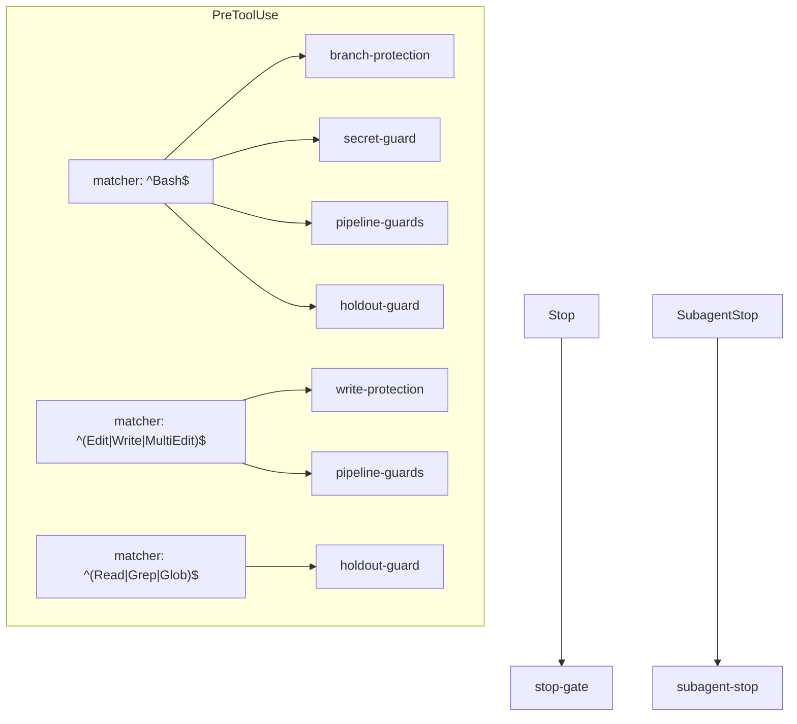

# Hooks Reference

The `factory-hook` dispatcher (`dist/factory-hook.js`, built from `src/hooks/`)
enforces invariants at Claude Code tool-use time, independent of any CLI call.
It is wired into `hooks/hooks.json` and invoked as `factory-hook <name>`. Each
guard is a separate, unit-testable function dispatched from the frozen registry in
`src/hooks/main.ts`.

Like the CLI: no args / `--help` lists the hooks and exits `0`; an unknown hook
exits `2`.

## The guards

| Hook                | Fires on                                    | What it does                                                                                                                                                                                                                                                                                                                                                                                               |
| ------------------- | ------------------------------------------- | ---------------------------------------------------------------------------------------------------------------------------------------------------------------------------------------------------------------------------------------------------------------------------------------------------------------------------------------------------------------------------------------------------------- |
| `branch-protection` | PreToolUse `Bash`                           | Block destructive git ops on protected branches.                                                                                                                                                                                                                                                                                                                                                           |
| `secret-guard`      | PreToolUse `Bash`                           | Block a `git commit`/`push` that stages a known secret shape.                                                                                                                                                                                                                                                                                                                                              |
| `pipeline-guards`   | PreToolUse `Bash`, `Edit\|Write\|MultiEdit` | Three invariants while a run is active: test-writer path scope; nested-shell / hook-bypass denial; ship gating (categorical agent-deny of `gh pr create`/`gh pr merge`). Each arm derives its owning run from its own inputs — never the global pointer (see [Run ownership](#run-ownership)).                                                                                                             |
| `holdout-guard`     | PreToolUse `Read\|Grep\|Glob`, `Bash`       | Deny reads of the holdout answer-key store.                                                                                                                                                                                                                                                                                                                                                                |
| `write-protection`  | PreToolUse `Edit\|Write\|MultiEdit`         | Deny writes to hardcoded TCB (trusted-computing-base) paths.                                                                                                                                                                                                                                                                                                                                               |
| `subagent-stop`     | SubagentStop                                | Log a stopping reviewer's parsed verdict (observational — the driver fold is the single writer of `task.reviewers[]`).                                                                                                                                                                                                                                                                                     |
| `stop-gate`         | Stop                                        | Finalize-on-stop an owned, all-terminal run so it never dangles `running`; block ONLY on state corruption (unreadable state / finalize failure). Does NOT block a session end with pending work — the run stays resumable via `factory resume`. A completed run whose docs stage is still pending reports `docs-ready`, not `all-terminal`, so the gate treats it as pending work and leaves it resumable. |

## `hooks.json` wiring

The seven guards are wired across six matcher entries (some guards run under more
than one matcher):

Each entry carries a timeout (5–15s) and a status message. The full mapping is in
`hooks/hooks.json`.

## Fail-closed posture

The guards fail **closed**: a write whose target sits inside a run worktree but
whose run/task state is missing or broken is treated as deny, never silently
allowed. The `pipeline-guards` ship arm is a categorical boundary — PRs are opened
and merged ONLY by the engine (a `child_process` `gh` call inside `factory drive`
that never transits this Bash-tool hook), so any `gh pr create`/`gh pr merge`
reaching the hook is an agent-initiated attempt and is unconditionally denied while
a run is active. The verifier floor that actually gates shipping is derived from
fresh ground truth _inside the engine_ (derive-don't-store) — there is structurally
no stored `*_gate` boolean to forge (see
[../explanation/derive-dont-store.md](../explanation/derive-dont-store.md)).

The `pipeline-guards`, `holdout-guard`, and the run-scoped checks act only when
they can resolve an owning run from their own inputs (below); otherwise they pass
through — so enabling the plugin in an unrelated session never leaks a live run's
scope into it.

## Run ownership

No hook reads the shared mutable pointer (`runs/current`). Each guard **derives
the run it belongs to from the signal it already holds** (Decision 30), so runs
across different repos run concurrently without cross-contamination:

- **Write-scope arm** (`pipeline-guards`, `Edit\|Write\|MultiEdit`): derives
  `{run_id, task_id}` from the **absolute target path**. A producer writes into
  `<dataDir>/worktrees/<run_id>/<task_id>/…`, so the path encodes both ids. A
  target under no worktree is not a producer write → pass through; a target under
  a worktree whose run/task state is missing or corrupt → deny (fail closed).
- **Bash arms** (nested-shell, ship): resolve the live run whose `owner_session`
  equals `CLAUDE_CODE_SESSION_ID`. No owning run → pass through; env id absent →
  retain prior behavior (these arms are lower-stakes — the nested-shell arm is a
  rail, the ship arm is dormant in production).
- **`stop-gate`**: resolves the run owned by the **stopping session** rather than
  the global pointer, so a clobber can't make it finalize the wrong run; unknown
  session → degrade to the global pointer.
- **`holdout-guard`**: run-independent (reads only `dataDir`) — correctly global.

The write-scope arm is a **rail**, not the boundary: the authoritative TDD
enforcement is the deterministic commit-order gate on the task branch
(`src/verifier/deterministic/strategies/tdd.ts`), so a path-anchor miss (e.g. a
producer write issued via `Bash`) does not weaken enforcement.
</content>
