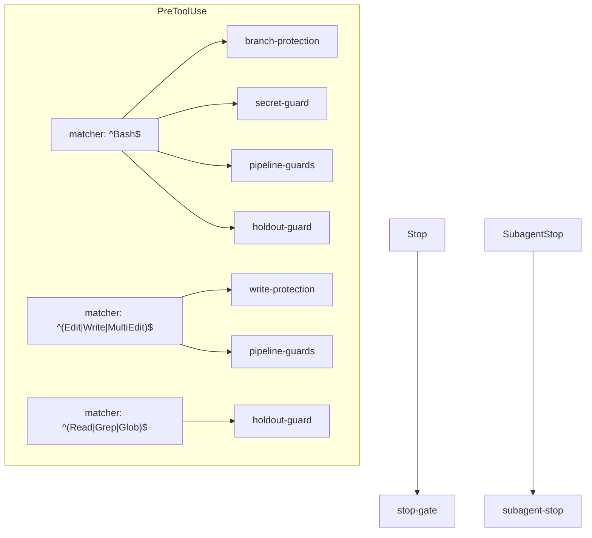

# Hooks Reference

The `factory-hook` dispatcher (`dist/factory-hook.js`, built from `src/hooks/`)
enforces invariants at Claude Code tool-use time, independent of any CLI call.
It is wired into `hooks/hooks.json` and invoked as `factory-hook <name>`. Each
guard is a separate, unit-testable function dispatched from the frozen registry in
`src/hooks/main.ts`.

Like the CLI: no args / `--help` lists the hooks and exits `0`; an unknown hook
exits `2`.

## The guards

| Hook                | Fires on                                    | What it does                                                                                                                                |
| ------------------- | ------------------------------------------- | ------------------------------------------------------------------------------------------------------------------------------------------- |
| `branch-protection` | PreToolUse `Bash`                           | Block destructive git ops on protected branches.                                                                                            |
| `secret-guard`      | PreToolUse `Bash`                           | Block a `git commit`/`push` that stages a known secret shape.                                                                               |
| `pipeline-guards`   | PreToolUse `Bash`, `Edit\|Write\|MultiEdit` | Three invariants while a run is active: test-writer path scope; nested-shell / hook-bypass denial; ship gating via a derived floor verdict. |
| `holdout-guard`     | PreToolUse `Read\|Grep\|Glob`, `Bash`       | Deny reads of the holdout answer-key store.                                                                                                 |
| `write-protection`  | PreToolUse `Edit\|Write\|MultiEdit`         | Deny writes to hardcoded TCB (trusted-computing-base) paths.                                                                                |
| `subagent-stop`     | SubagentStop                                | Append a reviewer `ReviewerResult` to task state via `StateManager`.                                                                        |
| `stop-gate`         | Stop                                        | Block a premature session end while a run is live; finalize-on-stop otherwise.                                                              |

## `hooks.json` wiring

The seven guards are wired across six matcher entries (some guards run under more
than one matcher):

Each entry carries a timeout (5–15s) and a status message. The full mapping is in
`hooks/hooks.json`.

## Fail-closed posture

The guards fail **closed**: a dangling `runs/current` symlink or broken run state
is treated as deny, never silently allowed. The `pipeline-guards` ship gate is the
sharpest example of derive-don't-store — `gh pr create`/`gh pr merge` are admitted
only when the floor verdict _derived from fresh ground truth_ passes; there is
structurally no stored `*_gate` boolean to forge (see
[../explanation/derive-dont-store.md](../explanation/derive-dont-store.md)).

The `pipeline-guards`, `holdout-guard`, and the run-scoped checks only act while a
run is active (`runs/current` resolves); with no active run they pass through.
</content>
