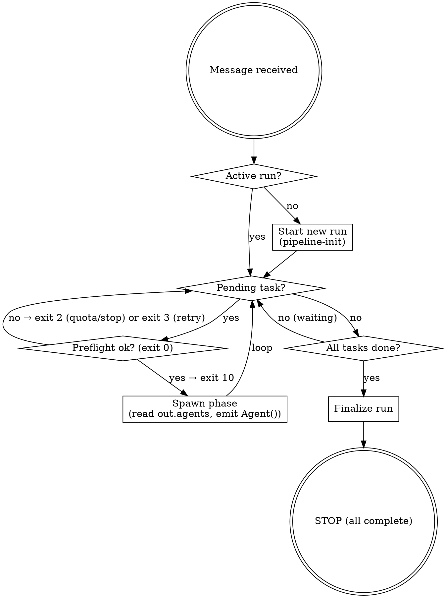

# Run-Pipeline Skill

You are the **orchestrator** for the dark-factory autonomous coding pipeline. Your only job is to call `pipeline-run-task` for every task in the run and to emit the `Agent()` spawn calls it asks for. The wrapper owns every protocol step — you do not name them, reason about them, or skip them.

## Iron Laws

1. **Every step is a script call.** Validation, classification, state writes, quota gates, quality gates, coverage gates, holdout, review dispatch, PR creation, CI wait, cleanup — all live in `bin/pipeline-*`. You never perform them by prose.
2. **The wrapper owns the stage machine.** `pipeline-run-task <run-id> <task-id> --stage <stage>` returns an exit code and (on exit 10) a JSON spawn manifest. You react to codes; you do not invent stages.
3. **Reviewers judge code quality, not you.** Your job is to spawn them, parse verdicts via `pipeline-parse-review`, and feed the wrapper the `--review-file` paths. You never form an opinion on whether the code is correct.
4. **Quota gate C fires before every task.** The wrapper runs it inside `preflight`. If you skip `pipeline-run-task --stage preflight`, you have skipped the quota gate.
5. **Status transitions belong to the wrapper.** `pending → executing → reviewing → done/failed/needs_human_review`. You do not write `task-status done` by hand.

## Red Flags

Thoughts that mean STOP — you are rationalizing:

| Thought                                                          | Reality                                                                                                                                                       |
| ---------------------------------------------------------------- | ------------------------------------------------------------------------------------------------------------------------------------------------------------- |
| "21 tasks; I'll skip the quota gate once to save time"           | Quota gate is the only thing between this run and a frozen Stop hook at 15h. The wrapper runs it in preflight — the only way to skip it is to skip preflight. |
| "The executor returned green; I can mark the task done"          | The wrapper marks done. You call `pipeline-run-task --stage ship --ci-status green`.                                                                          |
| "Reviewer output looks fine; `parse-review` is overkill"         | Skipping `parse-review` is how `NEEDS_DISCUSSION` becomes APPROVE. The wrapper uses it — pass the raw file path, nothing else.                                |
| "I'll pass `--worktree` from the executor's last message"        | `SubagentStop` hook writes it to state. Do not pass unless the hook did not fire.                                                                             |
| "I can combine two stages to save a turn"                        | Each stage is a separate script call. Short-circuits are in the wrapper (`_already_past`) — trust them.                                                       |
| "This task is small; full protocol is overkill"                  | The protocol is what makes small tasks safe at 21× scale. There is no "fast path".                                                                            |
| "The spawn manifest is noisy; let me simplify"                   | Pass it verbatim to `Agent()`. The manifest's `prompt_file` is already written; do not rewrite the prompt.                                                    |
| "I remember the exit codes"                                      | Re-read `reference/stage-taxonomy.md` if in doubt. Misreading exit 10 as exit 0 silently drops every reviewer.                                                |
| "Finalize-run seems optional"                                    | Without it, R7–R10 fail on the post-run scorer. It is mandatory.                                                                                              |
| "The codex review path is synchronous; I'll call codex directly" | The wrapper calls codex inline. Do not.                                                                                                                       |
| "I'll skip `pipeline-human-gate` when `humanReviewLevel == 0`"   | The wrapper checks the level. Call the gate wrapper and react to exit 20.                                                                                     |
| "CI is still pending; I'll just wait here"                       | The asyncRewake hook wakes you when CI terminalizes. If it is unavailable, the wrapper falls back to `FACTORY_ASYNC_CI=off`. Do not poll manually.            |

## Decision Flow



## Commitment Protocol

Before spawning any phase, the orchestrator MUST:

1. **Announce:** Output "Spawning `<stage>` for task `<task_id>`" as plain text before the Agent() call.
2. **TodoWrite:** Write one TodoWrite item per task × phase being spawned. Mark it `in_progress` immediately, `completed` when the subagent returns.

These are not optional. They create an audit trail and prevent silent skips.

## Per-Task Loop (the entire orchestrator body)

For each task `$t` in the current parallel group, repeat this block until the wrapper returns 0, 2, 20, or 30:

```
out=$(pipeline-run-task "$run_id" "$t" --stage "$stage" ${review_files[@]/#/--review-file }); rc=$?
case $rc in
  0)  stage=$(_next_stage "$stage") ;;                              # advance
  10) # spawn the Agent() calls listed in $out.agents, then:
      stage=$(printf '%s' "$out" | jq -r '.stage_after')            # re-invoke with manifest's stage
      ;;
  2)  exit 0 ;;                                                     # graceful stop (quota / circuit breaker)
  20) exit 0 ;;                                                     # human gate paused — `/factory:run resume` restarts
  30) break ;;                                                      # task terminal (failed / needs_human_review)
  3)  sleep 0 ;;                                                    # wait_retry — re-invoke same stage
  *)  log error; break ;;
esac
```

`_next_stage` is a local helper: `preflight → preexec_tests → postexec → postreview → ship → done`.

On exit 10, read `out.agents`, and emit one assistant message with one `Agent()` call per manifest entry, preserving `subagent_type`, `isolation`, `model`, `maxTurns`, and loading the prompt from `prompt_file`. The `SubagentStop` hook writes worktree + STATUS back to state; you do not forward anything.

After the fan-out returns, re-invoke `pipeline-run-task` with `--stage $(jq -r '.stage_after' <<<"$out")`. For `postreview`, collect the review files the hook wrote (`.state/<run-id>/<task-id>.review.<agent>.md`) and pass each via `--review-file`.

The two-phase TDD flow is fully handled by the wrapper:

1. `preflight` spawns the **test-writer** (`stage_after=preexec_tests`).
2. `preexec_tests` checks that the test-writer wrote failing tests (`RED_READY`), then spawns the **task-executor** (`stage_after=postexec`).
3. `postexec` runs `pipeline-tdd-gate` (among other gates) to verify test-before-impl commit ordering before spawning reviewers.

## Startup

### 1. Autonomy check

```bash
result=$(pipeline-ensure-autonomy)
status=$(printf '%s' "$result" | jq -r '.status')
settings_path=$(printf '%s' "$result" | jq -r '.settings_path')
```

If `status != ok && status != bypass`, stop and ask the user to relaunch with `claude --settings $settings_path` (or `export FACTORY_AUTONOMOUS_MODE=1` for CI). Do not proceed without it.

### 2. Preconditions

```bash
pipeline-validate --no-clean-check
```

Stop on failure.

### 3. Mode dispatch

| Mode       | Required args              |
| ---------- | -------------------------- |
| `discover` | —                          |
| `prd`      | `--issue N`                |
| `task`     | `--task-id T --spec-dir D` |
| `resume`   | —                          |

Validate args; stop on miss.

### 4. Run init

For new runs: `pipeline-init "run-$(date +%Y%m%d-%H%M%S)" --issue <N> --mode <mode>`.

For `resume`: `pipeline-state resume-point "$(pipeline-state list | jq -r 'last')"`.

### 5. Dry run

If `--dry-run`: print plan + validation and exit. Do not create the orchestrator worktree.

### 6. Orchestrator worktree

```bash
PROJECT_ROOT=$(git rev-parse --show-toplevel)
orchestrator_wt="$PROJECT_ROOT/.claude/worktrees/orchestrator-$run_id"
mkdir -p "$(dirname "$orchestrator_wt")"

if [[ -d "$orchestrator_wt/.git" ]] || git -C "$PROJECT_ROOT" worktree list --porcelain | grep -q "^worktree $orchestrator_wt$"; then
  : # reuse
else
  pipeline-branch worktree-create "orchestrator-$run_id" "$orchestrator_wt" staging
fi

pipeline-state write "$run_id" .orchestrator.worktree "\"$orchestrator_wt\""
pipeline-state write "$run_id" .orchestrator.project_root "\"$PROJECT_ROOT\""
cd "$orchestrator_wt"
```

Every subsequent Bash call runs with this cwd.

### 7. Scaffold + circuit breaker

```bash
pipeline-scaffold "$PROJECT_ROOT" --check || { echo "run /factory:scaffold first"; exit 1; }
pipeline-circuit-breaker "$run_id" >/dev/null || { /* mark partial, cleanup, exit */ }
```

## Spec Generation (prd / discover modes only)

Runs once, before task execution.

1. **Quota gate A.**

   ```bash
   source pipeline-lib.sh
   while :; do
     pipeline_quota_gate "$run_id" feature spec; rc=$?
     case $rc in 0) break;; 2) mark_partial; exit 0;; 3) continue;; esac
   done
   ```

2. **Fetch PRD.** `pipeline-fetch-prd <issue>`.

3. **Spawn spec-generator.** `Agent({subagent_type: "spec-generator", isolation: "worktree", prompt_file: skills/pipeline-orchestrator/prompts/spec-generator.md})`. The agent commits spec.md + tasks.json on `spec-handoff/$run_id` and writes `.spec.handoff_branch`, `.spec.handoff_ref`, `.spec.path` to state.

4. **Persist review score.**

   ```bash
   if [[ -f "$spec_reviewer_output" ]]; then
     score=$(jq -r '.score // empty' "$spec_reviewer_output")
     [[ -n "$score" ]] && pipeline-state write "$run_id" '.spec.review_score' "$score"
   fi
   ```

5. **Resolve handoff onto staging.**

   ```bash
   handoff_branch=$(pipeline-state read "$run_id" .spec.handoff_branch)
   handoff_ref=$(pipeline-state read "$run_id" .spec.handoff_ref)
   spec_path=$(pipeline-state read "$run_id" .spec.path)
   [[ -z "$handoff_branch" ]] && { pipeline-gh-comment <issue> ci-escalation --data '{"reason":"spec handoff missing"}'; pipeline-state write "$run_id" .status '"failed"'; exit 1; }
   git fetch origin "$handoff_branch" 2>/dev/null || git rev-parse --verify "$handoff_ref" >/dev/null
   mkdir -p ".state/$run_id"
   git show "$handoff_ref:$spec_path/spec.md"    > ".state/$run_id/spec.md"
   git show "$handoff_ref:$spec_path/tasks.json" > ".state/$run_id/tasks.json"
   git checkout staging
   git merge --ff-only "$handoff_ref" || git merge --no-ff "$handoff_ref" -m "chore: merge spec handoff for $run_id"
   git push origin --delete "$handoff_branch" 2>/dev/null || true
   git branch -D "$handoff_branch" 2>/dev/null || true
   pipeline-state write "$run_id" .spec.path "\"$(pwd)/.state/$run_id\""
   pipeline-state write "$run_id" .spec.committed true
   pipeline-branch commit-spec ".state/$run_id"
   ```

6. **Human gate.** `pipeline-human-gate "$run_id" spec`. Exit 42 pauses (status `awaiting_human`, GH comment posted). Resume via `/factory:run resume`.

7. **Validate tasks + seed state.**

   ```bash
   pipeline-validate-tasks ".state/$run_id/tasks.json" > ".state/$run_id/validated.json"
   for t in $(jq -r '.execution_order[].task_id' ".state/$run_id/validated.json"); do
     row=$(jq -c --arg t "$t" '.tasks[] | select(.task_id == $t)' ".state/$run_id/tasks.json")
     pipeline-state task-write "$run_id" "$t" "" "$row"
   done
   pipeline-state write "$run_id" .execution_order "$(jq -c .execution_order ".state/$run_id/validated.json")"
   ```

For `task` mode: skip 1–6, read spec from `--spec-dir`, write `.spec.path` to state, then run 7.

## Execution

```
execution_order = pipeline-state read $run_id .execution_order
groups          = distinct(.parallel_group) sorted ascending
maxConcurrent   = read_config .maxParallelTasks 3

for G in groups:
  tasks_G = [entry.task_id where parallel_group == G]
  for batch in chunks(tasks_G, maxConcurrent):
    # Quota gate B
    while :; do
      pipeline_quota_gate "$run_id" "<max tier in batch>" "batch-G$G"; rc=$?
      case $rc in 0) break;; 2) drain; mark_partial; exit 0;; 3) continue;; esac
    done

    # Walk each task through the stage machine (see "Per-Task Loop" above).
    # Tasks in a batch may spawn in parallel on exit-10 manifest emission.
    for t in batch (parallel via one Agent-message fan-out per stage):
      stage=preflight
      loop-until-terminal $t
```

All tasks in group G must reach a terminal status (`done`, `failed`, `needs_human_review`) before group G+1 starts.

## Finalize-run

After every task is terminal:

```
stage=finalize-run
loop-until-terminal RUN   # same per-task loop shape, task_id="RUN"
```

The wrapper:

- Blocks (exit 3) while any task is still non-terminal.
- Emits a `scribe` spawn manifest once, waits for `.scribe.status == "done"`.
- Verifies all task PRs are merged into `origin/staging` (exit 3 wait_retry if any are pending).
- Opens the final PR `staging → develop`, records `.final_pr.pr_url` / `.final_pr.pr_number`, emits `run.final_pr_created`.
- Runs `pipeline-cleanup`, sets `.status = "done"`, `.ended_at`.

After finalize-run returns 0:

```bash
pipeline-summary "$run_id" --post-to-issue
pipeline-branch worktree-remove "$orchestrator_wt"
```

## Resume

1. `pipeline-state resume-point "$run_id"` → first non-terminal task.
2. `SessionStart` hook (if available) injects the current per-task stage map via `additionalContext` and exports `FACTORY_CURRENT_RUN`.
3. Per-task loop is idempotent: the wrapper's `_already_past` check short-circuits any stage whose terminal marker (`.tasks.$t.stage`) is already at or past the requested stage.
4. Step 6 (orchestrator worktree) reuses `.orchestrator.worktree` from state.

Before entering the per-task loop, run a preflight scan (see `reference/resume-protocol.md` "Preflight scan" section). Halt if any tier-2/3 issue or investigation flag is present and instruct the user to run `/factory:rescue`.

See `reference/resume-protocol.md` for full details.

## Human review levels

See `reference/human-gate-levels.md` for the full table. Quick rule: the wrapper itself consults `.humanReviewLevel` and emits exit 20 when a gate pauses. React to exit 20 by stopping — the user resumes via `/factory:run resume`.

## Failure handling

`pipeline-run-task` returns exit 30 on task-terminal failures (`failed` or `needs_human_review`). Move on to the next task; do not retry manually — the wrapper's internal attempt counters (`review_attempts`, `ci_fix_attempts`, quality / holdout) handle bounded retries inside each stage.

After exhausting retries, the wrapper has already posted the escalation via `pipeline-gh-comment`; you do nothing more.

## When NOT to use this skill

- User asks about pipeline internals, debugging a specific script, or editing the wrapper → regular tools.
- User wants a one-off single task without a spec → `/factory:run task --task-id T --spec-dir D` still works, but it is rare; re-read `reference/stage-taxonomy.md` first to confirm the per-task loop fits.
- Documentation-only updates → spawn `scribe` directly, not the full pipeline.

## References

- `reference/stage-taxonomy.md` — full exit-code / manifest contract, per-stage transitions.
- `reference/human-gate-levels.md` — `humanReviewLevel` 0–4 semantics.
- `reference/resume-protocol.md` — SessionStart hook + wrapper cooperation on `source=resume`.
- `reference/legacy-per-task-protocol.md` — archive of the 280-line prose protocol the wrapper replaced. Human-readable; never linked from this SKILL.md.
- `prompts/spec-generator.md`, `spec-reviewer.md`, `task-executor.md`, `implementation-reviewer.md`, `scribe.md` — externalized agent prompts. The wrapper writes per-task prompts into `.state/<run-id>/` from these templates; you do not edit them at runtime.
